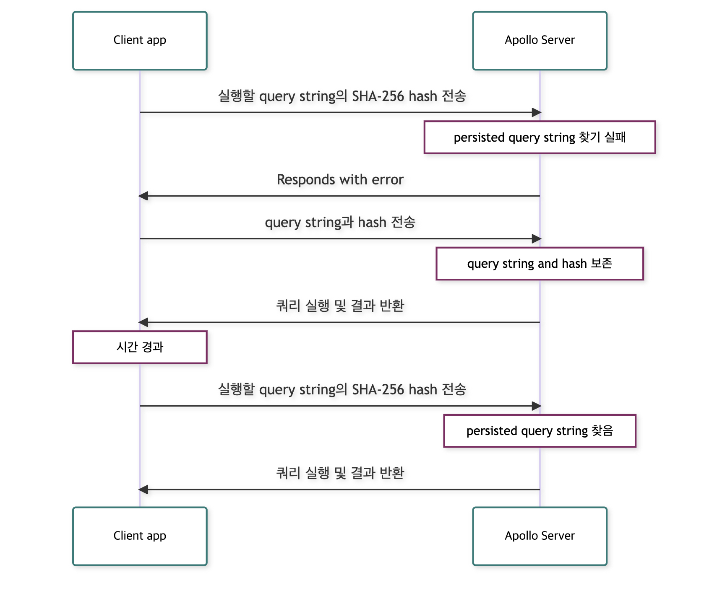

### 요청을 작게 보내 network 성능을 개선하기

- 번역 원본: https://www.apollographql.com/docs/apollo-server/performance/apq/

클라이언트는 GraphQL string을 포함한 HTTP 요청을 Apollo Server에 쿼리를 보낸다. Graph의 스키마에 따라 유효한 query string 사이즈가 임의대로 커질 수 있다. query string이 커지면, latency 및 네트워크 사용량이 늘어나 클라이언트 성능을 현저히 떨어뜨릴 수 있다.

큰 쿼리 스트링의 네트워크 성능을 개선하기 위해, Apollo Server는 **Automatic Persisted Queries** (**APQ**)를 지원한다. Persisted query는 서버사이드에 캐시된 query string으로, 고유 식별자를 가지고 있다. (SHA-256 hash 알고리즘을 이용)

클라이언트는 query string 대신에 이 식별자를 보내 요청 사이즈를 획기적으로 줄인다. (응답 사이즈에 영향은 없다)

요청하는 client 쪽에서 query string를 처음에 Apollo Server에 보내줘야 이를 보존할 수 있다. 따라서 각각의 고유한 query string이 최소한 한 번은 보내져야 한다. 아무 클라이언트나 query string을 persist로 보내면, 해당 query를 실행하는 모든 client는 APQ의 이점을 누릴 수 있다.



persisted query는 특히 클라이언트가 GET 요청 쿼리들을 보낼 때 효과적이다. 브라우저 캐시와 CDN 연동의 이점을 클라이언트가 이용할 수 있게 한다.

쿼리 식별자들은 항상 같은 결과를 도출하는(deterministic) hash 형태이기 때문에, 클라이언트들은 런타임에 이것들을 생성한다. 추가적인 빌드 과정은 필요하지 않다.

## Apollo Client 세팅

Apollo Server는 추가적인 설정 없이 APQ를 지원한다. 그러나 client-side 설정은 조금 필요하다.

첫 째로, `createPersistedQueryLink` 함수를 `ApolloClient`를 초기화하는 파일에 넣어야한다.

```jsx
import { createPersistedQueryLink } from "@apollo/client/link/persisted-queries";
```

이 함수는 client의 [Apollo Link chain](https://www.apollographql.com/docs/react/api/link/introduction/)에 추가할 수 있는 link를 생성한다. 이 link는 APQ 식별자들을 생성하고, hash된 query에 대해 GET 요청을 사용하며, 필요한 경우 query string으로 요청을 재시도하는 역할을 한다.

Link가 종료되기 전에 persisted query를 chain의 아무 위치에나 추가해보자. 아래 예시는 기본 2개의 link chain이 있는 경우를 보여준다.

```jsx
import { ApolloClient, InMemoryCache, HttpLink } from "@apollo/client";
import { createPersistedQueryLink } from "@apollo/client/link/persisted-queries";
import { sha256 } from 'crypto-hash';

const linkChain = createPersistedQueryLink({ sha256 }).concat(
  new HttpLink({ uri: "http://localhost:4000/graphql" }));

const client = new ApolloClient({
  cache: new InMemoryCache(),
  link: linkChain,
});
```

### Command line 테스트

APQ를 직접 커맨드 라인을 통해 테스트할 수 있다. APQ 요청이 어떻게 생겼는지 명확히 보고 Apollo Client, 나아가 GraphQL 클라이언트에서 APQ를 지원할 수 있도록 해보자.

... [More Details](https://www.apollographql.com/docs/apollo-server/performance/apq/#command-line-testing).. (추후 보충)

## CDN에서 APQ를 이용해 `GET` 요청하기

CDN과 Apollo Server를 운영한다면, APQ를 사용하기 아주 좋다. CDN은 주로 `GET` 요청만을 캐싱한다. 많은 GraphQL 쿼리는 너무 길어서 캐시 가능한 `GET` 요청에는 적합하지 않는다.

APQ link가 `createPersistedQueryLink({ useGETForHashedQueries: true })` 에 의해 생성되어 있으면, Apollo Client는 짧은 hashed query를 자동으로 `GET` 요청으로 보내고, CDN은 해당 요청을 처리할 수 있다. 긴 query나 모든 mutation에 대해서는 POST 요청 방식을 사용하게 된다.

## 캐시 설정

Apollo Server는 디폴트로 APQ 레지스트리를 로컬 인메모리 캐시에 저장한다. `ApolloServer` constructor의 최상위에 `cache`의 값으로 다른 캐시를 넣어주면, 해당 캐시를 사용한다.

또한, 특정한 APQ 레지스트리의 캐시를 바라보게 할 수 있다. `ApolloServer` constructor 옵션으로 `persistedQueries` object를 넣고, 그 안에 속성으로 `cache`를 넣어 선호하는 캐시 클래스의 인스턴스를 넣는다. 아래 data store들이 제공된다.

| data store/class name | library |
| --- | --- |
| Local in-memory cache (default)<br>`InMemoryLRUCache` | apollo-server-caching |
| Memcached<br>`MemcachedCache` | apollo-server-cache-memcached |
| Redis (single instance or Sentinel)<br>`RedisCache` | apollo-server-cache-redis |
| Redis Cluster<br>`RedisClusterCache` | apollo-server-cache-redis |

### 적용 예시

**Memcached**
```tsx
$ npm install apollo-server-cache-memcached
```

```tsx
const { MemcachedCache } = require('apollo-server-cache-memcached');
const { ApolloServer } = require('apollo-server');

const server = new ApolloServer({
  typeDefs,
  resolvers,

  persistedQueries: {
    cache: new MemcachedCache(
      ['memcached-1.local', 'memcached-2.local', 'memcached-3.local'],
      { retries: 10, retry: 10000 }, // Options
    ),
  },
});
```

[Other methods](https://www.apollographql.com/docs/apollo-server/performance/apq/#cache-configuration)

## 캐시 time-to-live(TTL) 조정

캐시의 TTL 값은 등록된 APQ가 얼마나 오래 캐시에 보존될 지 결정한다. 캐시된 쿼리의 TTL이 경과해 지워지고 나면, 다음에 클라이언트에서 전송되었을 때 재등록된다. 

Apollo Server의 default인 in-memory store는 APQ의 TTL을 정해두지 않는다. (캐시 파기 정책에 따라 덮여지기 전까지 APQ를 캐시된 상태로 남겨둔다.) 

지원되는 다른 모든 스토어들에서는 기본 TTL 설정이 300초이다. `persistedQueries` 옵션의 `ttl` attribute를 통해서 간단하게 이 값을 덮어쓰거나 disable할 수 있다. 

```tsx
const server = new ApolloServer({
  typeDefs,
  resolvers,
  persistedQueries: {
    ttl: 900, // 15 minutes
  },
});
```

TTL을 전부 disable시키려면 `ttl`에 `null`을 넣는다.

```tsx
const server = new ApolloServer({
  typeDefs,
  resolvers,
  persistedQueries: {
    ttl: null,
  },
});
```

in-memory cache의 default 동작은, 캐시의 기본 파기 정책에 의해 덮어씌워지기 전까지 APQ를 캐시에 그대로 두는 것이다.

## Disabling APQ

`persistedQueries` attribute를 `false`로 설정함으로써 APQ를 완전히 disable 시킬 수 있다.

```tsx
const server = new ApolloServer({
  typeDefs,
  resolvers,
  persistedQueries: false,
});
```