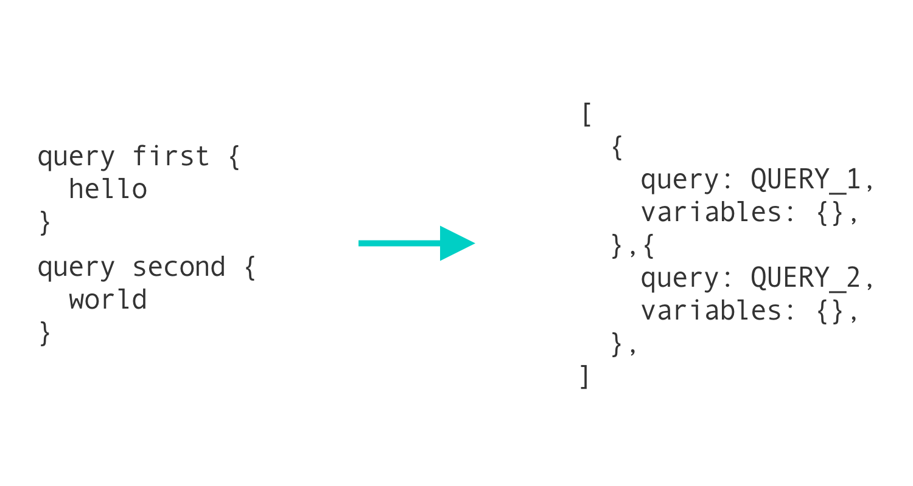

- 우리 회사에서 사용 중인 Batching에 대해 자세하게 알고 싶어 아래 글을 번역했다.
    
    [https://www.apollographql.com/blog/apollo-client/performance/batching-client-graphql-queries/](https://www.apollographql.com/blog/apollo-client/performance/batching-client-graphql-queries/)
    
- 번역하는 중에 찾아 보니, [클래스101 테크블로그에 올라와있는 관련 글](https://class101.dev/ko/blog/2020/06/23/rogiry)을 발견했다. (오오오) 
원본글은 2021년까지 세부사항들이 업데이트된 것으로 보이고, 전반적인 내용은 같다.

모던 앱들은 수다스럽다. 많은 데이터들을 필요로 하기 때문에 내재된 서비스들에 많은 요청을 보낸다. GraphQL를 도입하면서 이런 이슈를 해결할 수 있다. 네트워크 비용을 소모하는 것을 피하기 위해, 여러 요청들을 한 번의 operation으로 캡슐화할 수 있다.

GraphQL이 이런 스타일의 data fetching을 장려하는 반면, React는 개발자들에게 컴포넌트에 따라 data fetching 로직을 분리하라고 장려한다. 아주 쓸모 있는 패턴이지만, app이 서버가 처리하기에 너무 많은 네트워크 요청을 보내는 이슈로 수렴한다. 이를 해결하려면 클라이언트의 operation들을 일괄적으로 묶어보내는 방법이 GraphQL 클라이언트에 적용될 수 있다. 그러나 때로는 batching이 도움보다는 해가 될 수도 있다.

배치를 사용하느냐 사용하지 않느냐, 그것이 문제로다.

이 post를 다 읽고나면, 당신은 Apollo의 client operation batching에 관한 다음 질문들에 답할 수 있어야 한다.

- Batching이 어떻게 동작하는가?
- Tradeoff는 무엇인가?
- 꼭 필요한가?
- Batching을 수동으로 적용할 수 있는가?
- Automatic Batching을 수정할 수 있는가?

## Batching이 어떻게 동작하는가?

Batching은 요청 여러개를 합쳐 하나의 요청을 만드는 절차이다. 주로 시간 분기점 단위로 수행된다. 예를 들어 50ms 단위로 분기할 때, 컴포넌트에서 쿼리를 요청하면 클라이언트는 쿼리를 바로 생성하는게 아니라 50ms를 기다린다. 그 시간동안 요청된 쿼리 전부가 같은 시점에 요청된다.

GraphQL app에서 batching하는 데에는 두 가지 방법이 있다.

첫번째는 **모든 operation을 GraphQL의 alias를 사용해 하나로 합치는 것**이다. 권장되는 방식은 아니다. 각 operation의 메트릭을 추적하기가 어렵고, 클라이언트에서 추가적인 작업을 해야해서 복잡도가 높아진다.

대신 **GraphQL 서버에 operation 배열을 전송하는 방식을 추천**한다. 서버가 operation 배열을 받아 각각의 operation을 분리해서 처리하는 방식이다. 단 한 번의 왕복을 요구하지만, operation 별 퍼포먼스를 추적할 수 있다. 

Apollo Client는 `apollo-link-batch-http`를 사용해 이를 처리한다. 이 경우 서버는 단일 operation들 뿐 아니라 array 형태로도 요청을 받을 수 있어야 한다는 점에 주목하자. 운 좋게도, `apollo-server`는 틀에서 벗어난 방식으로 이를 지원한다.



더 자세한 batching 작동 과정을 원한다면 이 [포스트](https://www.apollographql.com/blog/apollo-client/performance/query-batching/)를 참고하자. 초기 Apollo Client의 batching을 소개하고 있다. 세부사항이 좀 바뀌었지만 기본 컨셉은 아직도 주효하다.

## Tradeoff는 무엇인가?

Batching은 클라이언트의 네트워크 성능을 향상시키는 완벽한 솔루션 같지만, 꼭 그렇지는 않다. Batching 요청은 클라이언트에서 로딩 시간이 긴 편이다. 예를 들어 각각 다른 컴포넌트에서 5개의 요청이 GraphQL endpoint에서 생성됐을 때, 그 중 하나의 응답 시간이 오래 걸리는 경우, 클라이언트는 모든 operation이 완료되기 전까지 아무런 결과를 받지 못한다. 다르게 말하면, **같이 묶인 operation들 중 가장 느린 것의 속도에 맞춰 완료된다는 것이다.**

GraphQL은 주로 여러 데이터 소스를 결합하는 데에 사용되기 때문에, 이런 점은 문제가 될 수 있다. 내재된 서비스 중 하나가 느린 경우 클라이언트 앱 전체에 영향을 미친다.

게다가 batching은 네트워크 트래픽에 대한 디버깅을 어렵게 한다. 일반적인 경우, 특정 operation의 응답이 지연되는지 명확히 확인 가능하다. 해당 요청을 보낸 컴포넌트는 로딩 상태가 오래 유지되고, 앱의 나머지 기능들은 그대로 동작하기 때문이다. 브라우저의 디버깅 툴을 사용해도 쉽게 발견할 수 있다. Batching 쿼리는 위와 같은 디버깅 방식들을 어렵게 만든다.

## 꼭 필요한가?

Batching 도입 시의 문제 해결 방법을 찾기 전에, 필요성에 대해 가장 먼저 생각해보자.

Batching 도입 방법은 쉽기 때문에, 필요성에 대한 실질적인 검증 없이 프로젝트에 도입하고 싶을 것이다. 사실, 아래 방법들을 시도해서 성능 이슈가 해결된다면 batching을 추천하지는 않는다.

- [Automatic persisted queries](https://www.apollographql.com/docs/apollo-server/performance/apq/) 사용 (요청 body 사이즈를 줄여줌)
- CDN을 이용해 Cache 요청하기 (Operation이 매번 GraphQL endpoint에 요청하는 것을 방지)
- Apollo Server에서 부분적인 쿼리 캐싱 허용하기 (Operation 처리를 눈에 띄게 빠르게 해줌)
- 가능하면 server에서 HTTP/2 사용하기 (요청의 다중 송신을 가능하게 해서, 효과적으로 일괄 처리함)

## Batching을 수동으로 적용할 수 있는가?

그렇다. 불필요한 요청을 방지하기 위해 가벼운 operation들을 수동 batch 처리할 수 있다. GraphQL에서는 작은 쿼리를 큰 쿼리에 합치는 방식으로 수행된다.

예를 들어 4개의 컨텐츠 블럭이 있는 페이지가 있으면, 블럭들이 각자 data fetch를 하기보다는 `container` 하나가 fetch하고 블럭 컴포넌트들에 값을 전달해줄 수 있다. 첫 섹션에서 이야기한 첫 방식과 비슷한 컨셉이다.

각자의 응답을 사용하는 컴포넌트의 쿼리들을 같이 배치하는 방식이 기존의 패턴들과는 반대되는, 직관적이지 못한 것처럼 느껴질 수 있다.

컨테이너 레벨에서 하나의 큰 GraphQL 쿼리를 만드는 것은 지양하자. 대신, 해당 쿼리를 쓰는 자식 컴포넌트들에 기존에 쓰던 방식으로 쿼리를 넣는다. 최적화한다면, 쿼리를 fragment로 바꾸고 각 컴포넌트 파일에서 export시킨다. fragment들을 컨테이너에서 import하여 컨테이너가 하나의 큰 쿼리를 만들고 fragment 결과를 children에 전달한다. 이런 방식을 사용하면, 로딩 및 에러 상태를 각 컴포넌트가 아닌 컨테이너 레벨에서 관리할 수 있다.

```jsx
// Container
import React from "react";
import { Query } from "react-apollo";
import gql from "graphql-tag";
import { View } from "react-native-web";

import Component1, { fragment as c1Fragment } from "./component-1";
import Component2, { fragment as c2Fragment } from "./component-2";

const CONTAINER_QUERY = gql`
  query Container {
    ...Component1
    ...Component2
  }

  ${c1Fragment}
  ${c2Fragment}
`;

export default () => (
  <Query query={CONTAINER_QUERY}>
    {({ loading, error, data }) => {
      return (
        <View>
          <Component1 data={data} loading={loading} error={error} />
          <Component2 data={data} loading={loading} error={error} />
        </View>
      );
    }}
  </Query>
);
```

```jsx
// Component 1
import React from "react";
import { View, Text } from "react-native-web";
import gql from "graphql-tag";

export const fragment = `
  fragment Component1 on Query {
    hello1: hello
  }
`;

export default ({ data, loading, error }) => (
  <View>
    <Text>Component 1</Text>
    {loading && <Text>Loading Component 1...</Text>}
    {error && <Text>Error Component 1...</Text>}
    {!loading && !error && data && <Text>{data.hello1}</Text>}
  </View>
);
```

```jsx
// Component 2
import React from "react";
import { View, Text } from "react-native-web";
import gql from "graphql-tag";

export const fragment = `
  fragment Component2 on Query {
    hello2: hello
  }
`;

export default ({ data, loading, error }) => (
  <View style={{ marginTop: 32 }}>
    <Text>Component 2</Text>
    {loading && <Text>Loading Component 2...</Text>}
    {error && <Text>Error Component 2...</Text>}
    {!loading && !error && data && <Text>{data.hello2}</Text>}
  </View>
);
```

수동 batching도 문제는 있다. 수동 batching 되는 operation들이 위 예시보다 더 크면, 한방쿼리를 캐싱하는 이점을 잃는다. 한방쿼리 캐시의 TTL(Time To Live: 캐시가 살아있는 시간)은 TTL이 가장 짧은 필드를 가진 operation을 따른다. Operation 내 필드 수가 증가하게 되면, 캐싱 수명이 짧은 것도 포함될 가능성이 커진다. 따라서 전체 operation의 캐싱 능력도 줄어든다. 

[한방쿼리와 TTL 계산법에 대한 참고 doc](https://www.apollographql.com/docs/studio/#cache-hints)

## Automatic Batching을 수정할 수 있는가?

Batching의 문제에 특별한 해결 방법은 없다. Batching을 적용하면 느린 부분이 생기고 나머지 진행을 더디게 만들 가능성이 항상 있다. 어쩔 때 수동 batching의 단점은 이점보다 더 크다. 너무 복잡하거나 잘 리팩터링하기에 규모가 너무 커질 수 있다.

**대부분의 operation들은 알아서 batch되도록 두고, 문제를 일으킬 만한 것만 수동으로 batch를 막아서** batching의 문제점을 해결해 볼 수 있다. 단계에 따라서 적용해보자.

1. 컴포넌트에 기존에 하던대로 쿼리를 넣는다.
2. 가장 네트워크 비용이 많이 드는 (expensive) 쿼리를 찾는다. (단순히 큰 쿼리는 아니다. [Apollo Engine](https://www.apollographql.com/engine) 등의 툴을 이용해 찾는다.)
3. Expensive한 operation의 쿼리를 요청할 때 context로 특정 값을 전달한다.
4. context 값 여부에 따라 `apollo-link-http` or `apollo-link-batch-http` 를 정할 수 있도록 `split` 메서드를 사용한다.

```jsx
import { HttpLink } from "apollo-link-http";
import { BatchHttpLink } from "apollo-link-batch-http";
import { split } from "apollo-link";

// 배치가 필요할 때 사용하는 link (디폴트)
// 다른 link임을 증명하기 위해 `batch: true`를 요청 header에 추가
const batchHttpLink = new BatchHttpLink({ uri, headers: { batch: "true " } });
// 배치 적용을 막을 때 쓰는 link
const httpLink = new HttpLink({ uri });

const client = new ApolloClient({
  // split: 1번째 인자가 return하는 boolean에 따라 2,3번째 인자 분기하는 함수 
  link: split(
    operation => operation.getContext().important === true,
    httpLink, // 위 함수가 true 이면 -- debatch
    batchHttpLink // false 이면, batch
  ),
  cache: new InMemoryCache()
});
```

```jsx
// batch 사용 여부를 수동 처리
const App = () => (
  <ApolloProvider client={client}>
    <View id="root">
      {/* 1번째 쿼리가 expenxsive하다고 가정 */}
      {/* add `important: true`를 context에 넣어 debatch */}
      <Query query={gql` query Test { hello }`} context={{ important: true }}>
        {({ loading, error, data }) => {
          return loading ? (
            <Text>Loading...</Text>
          ) : (
            <Text>Unbatched: {data.hello}</Text>
          );
        }}
      </Query>
      <Query query={gql` query BatchTest { hello }`}>
        {({ loading, error, data }) => {
          return loading ? (
            <Text>Loading...</Text>
          ) : (
            <Text>Batched: {data.hello}</Text>
          );
        }}
      </Query>
    </View>
  </ApolloProvider>
);
```

## 결론

Batching은 다루기 어려운 주제이다. Batching을 사용하는 데에는 많은 이유가 있다. 그러나 batching을 통해 해결한 문제들보다 더 많은 문제를 양산할 수도 있다.

바라건대, 이 정보들로 무장하고, 클라이언트의 성능 개선에 대한 결정을 할 때 자신감을 갖길 바란다.

## 🧑‍🌾 번역하면서 느낀점

- 좋은 기능이라고만 생각했고 단점에 대해서는 몰랐다. 모든 것은 장단이 있는 법...
- 이미 batching을 적용하고 있는 우리 회사 서비스의 코드를 돌아봐야지.
    - Debatch된 쿼리가 있는지 찾아봐야지. (context 먹이고 있는거 본 적 있다.)
    - 가까운 층위에서 같은 쿼리가 중복되더라도 operation을 관심사에 따라 쪼개는 경우가 많다. 그런 면에서 우리 코드 같은 경우에 batching이 필요하다고 판단했을 것 같다.
- Batch로 요청을 보내는 BatchHttpLink도 다음 스텝으로 공부해야겠다.