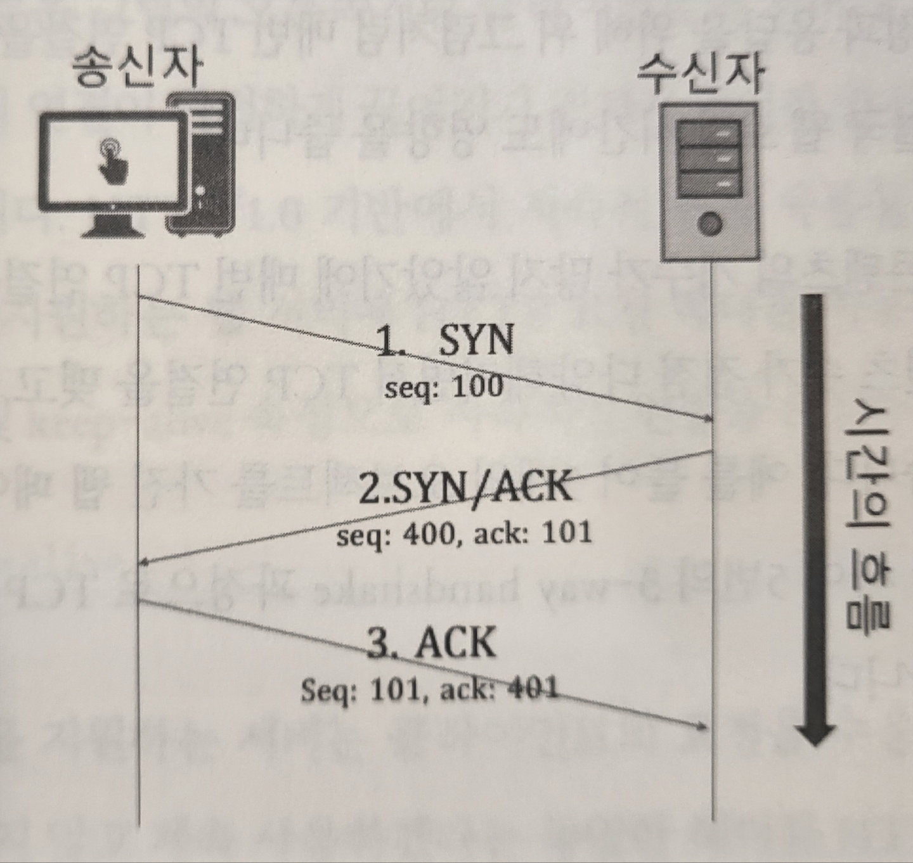
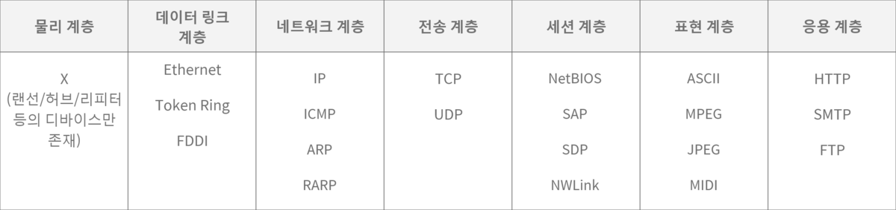
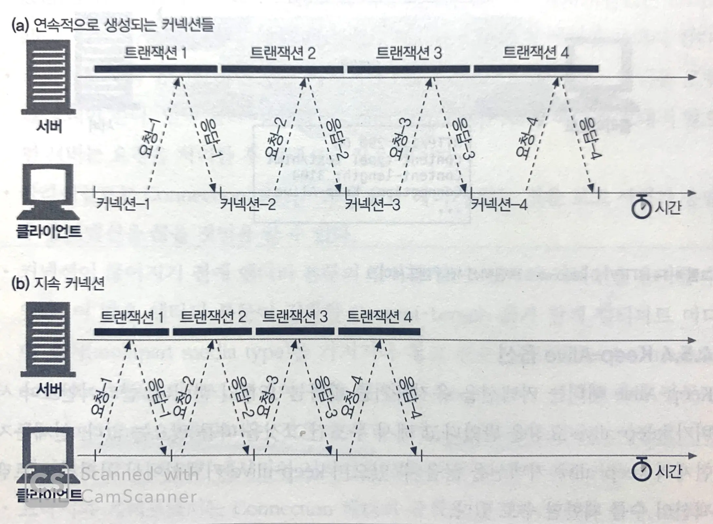
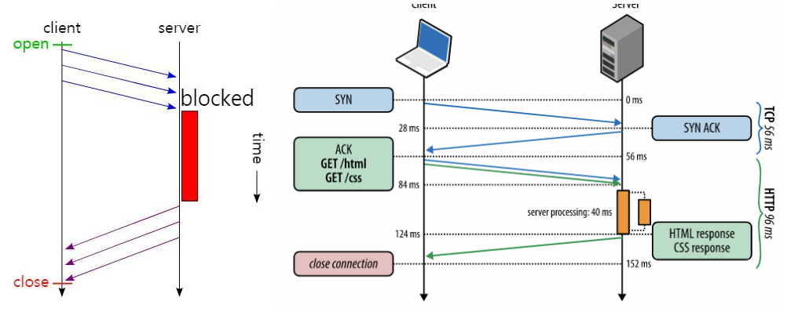
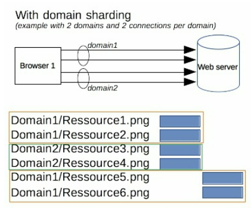
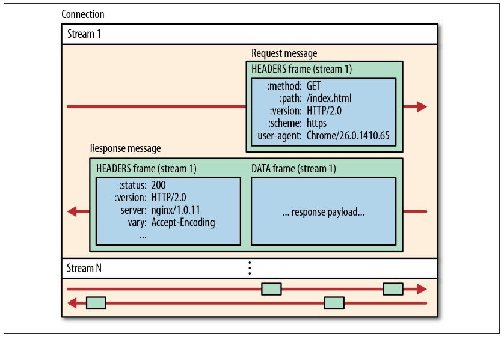
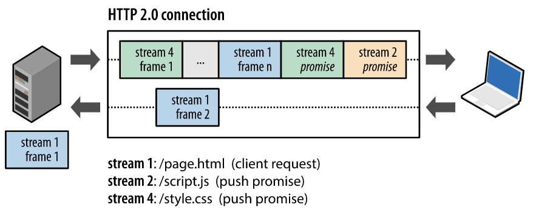
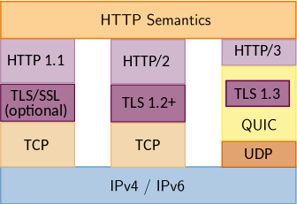
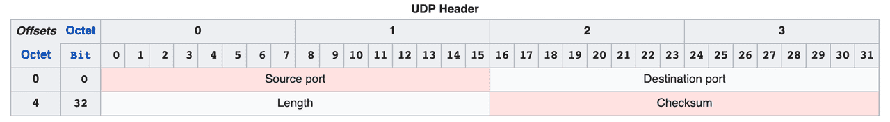

### 💡 HTTP? 💡

텍스트 이상 콘텐츠들을 웹에서 전달하기 위해 만들어진 프로토콜

## HTTP의 전송 계층

네트워크 계층 구조에서 HTTP는 일곱번째인 응용 계층에 속하고 TCP, UDP는 네번째인 전송 계층이다.

- 응용 계층은 전송 계층을 바탕으로 운영된다.
- 전송 계층은 데이터가 제대로 전달되었는지 확인하는 역할을 한다.

### TCP

- ~ HTTP2까지
- 요청에 대한 응답의 정확성을 추구
- 응답이 오지 않으면 지속적으로 요청함
- 요청이 유실되면 안되고 응답을 필수적으로 받아야하는 경우 (ex. Email)

- **3-way handshake**

  TCP는 데이터 전송 전 커넥션 확립을 해야 하며 절차는 3단계이다.

  1. 클라이언트 → 서버 : 접속을 요청하는 SYN 패킷을 발송
  2. 서버 → 클라이언트 : SYN/ACK(확인 완료) 패킷 발송
  3. 클라이언트 → 서버 : ACK

<figcaption align="center"><i>출처: 웹성능 최적화 기법 (도서)</i></figcaption>
 

- TCP가 데이터 유실 여부를 확인하는 법: 패킷에 일련 번호를 부여해서 데이터가 잘 왔는지 확인 가능하게 함

### UDP

- HTTP3
- 응답의 신속성이 중요
- 영상 스트리밍과 게임에서 많이 사용함
- 요청이 유실될 수 있음
- **3-way handshake** 없음  
  : 수신자의 수신 가능 여부를 확인하지 않고 일방적으로 데이터를 전송한다. 각각의 패킷은 독립적으로 처리되므로 데이터 순서는 보장하지 않는다.

### 기타 용어

| 패킷 | 특정한 구조를 가진 데이터 조각 (destination, source, type, data … 등으로 이루어짐)                                                                                                                                                                                                                                             |
| ---- | ------------------------------------------------------------------------------------------------------------------------------------------------------------------------------------------------------------------------------------------------------------------------------------------------------------------------------ |
| 계층 | 네트워크 통신 아래에는 무수한 통신 과정이 있는데, 이를 7단계로 구조화한 것. 표준 모델은 1984에 발표된 OSI 7 계층 - [상세설명](https://www.sharedit.co.kr/posts/7482)    <figcaption align="center"><i>각 계층별 대표 프로토콜</i></figcaption> |

## HTTP0.9 ~ 1.1

HTTP/1.0 전에는 클라이언트와 서버 간 통신 신뢰성에 초점을 둔 기능 업데이트가 중심이었으나, 1.0 이후에는 통신 속도에 중점을 두기 시작했다.

HTTP를 최적화하기 위한 agenda들은 아래와 같다.

### 연결 재사용

초기 HTTP는 매 TCP 요청마다 클라이언트와 서버가 연결을 맺고 끊었다. 송수신의 신뢰성을 위한 방식이지만, 웹에서 다루는 컨텐츠 수가 늘어나면서 성능에 큰 걸림돌이 됐다.

이 문제를 해결하기 위해 1.1 버전에 TCP 연결을 재사용하는 기술이 등장하게 됐다.

> Connection: Keep-Alive

클라이언트는 위와 같은 헤더를 요청에 넣어 연결을 유지하고 싶다는 의사를 보내고, 서버는 이후 해당 클라이언트의 요청-응답에 TCP 연결을 재사용할지 결정한다.

<figcaption align="center"><i>출처 : HTTP 완벽가이드 - 4.5.2 HTTP/1.0+의 Keep-Alive 커넥션</i></figcaption>

 
HTTP1.1부터는 Connection 기본값이 keep-alive가 되어서, 원치 않는다면 값으로 close를 넣어준다. 하지만 기본값으로 요청에 포함된다고 해도 서버가 커넥션 지속 연결을 보장하는 것은 아니다.

클라이언트에서 keep-alive로 요청을 보내더라도 서버는 여러 클라이언트에서 동시다발적으로 들어오는 많은 요청들을 핸들링하기에 충분치 않고, 지속적인 통신이 일어나지 않는 클라이언트의 경우 커넥션이 살아 있으면 자원이 낭비된다는 문제가 있다.

[keep-alive 기능에 대한 자세한 설명](https://goodgid.github.io/HTTP-Keep-Alive/)

### Head of Line Blocking

Head of Line Blocking(HOL) 문제는, 하나의 요청에 병목이 생기면 다른 요청들도 다같이 늦어진다는 의미이다. TCP 통신 시, **모든 요청은 반드시 정확한 순서대로 처리**된다.

초기에는 선입선출 방식이라, 요청과 응답이 여럿일 때 하나의 응답이 지연되면 그 다음 순서의 요청과 응답도 지연되었다.

HTTP 1.1의 Pipelining은 먼저 보낸 요청의 응답이 늦더라도 기다리지 않고 병렬적으로 다음 요청을 전송하는 기술이다. 그러나 이 기술은 요청 순서에 맞게 응답 순서를 지켜야 되기 때문에 HOL 문제를 제대로 해결하지 못했다.

<figcaption align="center"><i>Pipelining</i></figcaption>
 

이를 해결하기 위해 Domain Sharding이라는 방법도 썼는데..
 
도메인을 여러개 설정해서 같은 서버에 리소스를 병렬로 요청해 받는 것이다. 여러개의 TCP 커넥션을 맺는 방식이다.

그러나 브라우저 별로 도메인 커넥션 개수 제한(Chrome: 6개)이 있기 때문에 문제를 제대로 해결한 것은 아니다.

<figcaption align="center"><i>Domain Sharding</i></figcaption>

## HTTP2

### 헤더 경량화

- 기존의 문제: 이전에는 응답을 전달 받을 때 헤더 압축이 안되어서 원래 크기로 받아야 했고, 매 요청마다 중복된 값을 전송했다.
- 해결 방법
  - 클라이언트-서버 사이에 가상 테이블을 두고, 중복 요청되는 헤더 값들을 저장한다. 이후 요청 시 참조하게 한다.
    - 정적 테이블: 자주 사용되는 필드를 저장
    - 동적 테이블: 통신 시 주고 받는 데이터들
  - 허프만 알고리즘으로 헤더 데이터를 압축한다.
    - 데이터 사용 빈도에 따라서 코드의 크기를 다르게 부여함. 예를 들어, 자주 요청하는 문자열 데이터가 있다면 작은 크기의 코드를 부여하고, 다음 요청 때는 문자열 대신 코드를 전송

### 멀티플렉싱

- 기존의 문제: Head of Line Blocking (상기 내용 참고)
- 이전 버전에서는 병렬 요청을 수행하려면 TCP 연결을 다수 생성해야 했으나,(Domain Sharding) 멀티플렉싱이라는 기술은 하나의 커넥션 안에서 전체 요청 및 응답 다중화가 가능하다.
- HTTP2에서는 전송 방식의 변화가 생겼다.
  - 도입된 구조
      
      
      - 프레임: HTTP2 통신에서 사용되는 가장 작은 단위로, 데이터를 텍스트에서 바이너리 형태로 인코딩. 헤더 프레임, 데이터 프레임으로 나뉜다.
          
          ⇒ 바이너리이기 때문에 파싱/전송 속도 빠름
          
      - 메시지: 다수의 프레임으로 이루어지는 요청 또는 응답
      - 스트림: 서버 → 클라이언트, 클라이언트 → 서버로 흐르는 데이터의 양방향 흐름(스트림). 복수개의 메시지가 포함.
      - 프레임들이 따로 도착하더라도 짝이 되는 프레임끼리 조립
  - 프레임이 여러개 모여 메시지가 되고, 요청 및 응답 메시지가 모여 스트림이 되는 구조
  - 하나의 TCP 연결 내에 여러개의 스트림이 생성되는데, 스트림의 수는 제한이 없음

### 서버 푸시

클라이언트가 명시적으로 요청하지 않아도 서버가 추가적인 리소스를 미리 클라이언트로 보낸다.

> 참고 자료: HTTP2까지의 버전별 통신 차이점을 나타낸, 어떤 능력자님의 [애니메이션](https://freecontent.manning.com/animation-http-1-1-vs-http-2-vs-http-2-with-push/)

## HTTP3

HTTP2가 HTTP1.1의 단점을 보완하고 새 기능을 추가하는 방식의 개선이라면, HTTP3는 아예 전송 계층인 TCP를 UDP 기반 QUIC으로 개선을 시도했다.

## QUIC

HTTP3는 UDP를 사용하는 QUIC라는 프로토콜을 기반으로 한다.
 
UDP는 빠르지만 신뢰성을 보장하기 어려워 QUIC이라는 계층을 추가하여 보완하였다.

<figcaption align="center"><i>버전별 프로토콜 계층 구조</i></figcaption>

### UDP의 유연성
TCP는 신뢰성과 혼잡 제어를 위해 많은 기능을 갖고 있다. 반면, UDP는 데이터 전송 자체에만 집중하여 설계되었다.
 
아래에서 헤더의 복잡성을 비교해보면 알 수 있다.

<figcaption align="center"><i>TCP header</i></figcaption>
 

<figcaption align="center"><i>UDP header</i></figcaption>
 

TCP의 헤더는 많은 필수 기능으로 채워져 있고, 커스터마이징의 여지 또한 없다.
UDP는 다른 방식으로 커스터마이징해서 단점을 보완할 수 있는 여지가 크다.

### TCP 자체의 HOL Blocking 방지

HTTP2에서도 완전히 해결하지 못한 것은 TCP의 HOL blocking 이슈인데, TCP를 사용하는 한 벗어날 수가 없다.
 
HTTP2 커넥션에서 TCP 패킷이 유실되면, 해당 패킷을 다시 전달받는 긴 시간 동안에 모든 스트림은 아무것도 진행할 수 없다.

반면 QUIC은 operation이 다중화되도록 설계됐고, 패킷 유실 시 해당 스트림에만 영향을 준다. 유실되지 않은 프레임은 도착 시 스트림에 바로 전달되며 정상적으로 절차를 진행한다.

### 커넥션 최적화

QUIC는 이론적으로 전송 왕복 시간이 0이다.

**첫 연결에서 설정에 필요한 정보와 함께 데이터를 함께 보낸다.**

또한, 연결에 성공하면 설정을 캐싱해서 다음 연결 시 handshake 필요없이 바로 데이터를 전송한다. **Connection UUID**라는 고유한 패킷 식별자를 사용한다.
 
한 번이라도 클라이언트와 서버가 데이터 전송을 수행했다면 커넥션을 다시 수립할 필요가 없다.

### 보안 강화

QUIC에서는 아래 방법으로 UDP의 부족한 보안성을 강화했다.

1. TLS 1.3를 통한 암호화
2. Source Address Token 발급하여 출발지 IP 검증
   - IP 변조 공격(IP Spoofing, Replay Attack) 방지

## HTTP3 적용하기

### 트렌드
- HTTP3는 모든 website의 25% 정도에서 사용되고 있다.(2023년 1월 8일 기준) [실시간 통계](https://w3techs.com/technologies/details/ce-http3)
- 구글의 자체 프로토콜이었던 HTTP3는 2022년 6월에 IETF 표준으로 수용됐다.

### 사용 팁

- 브라우저들 대부분은 아직 QUIC 프로토콜을 manual하게 허용하고 있다.
  - ex. Chrome의 경우 "chrome://flags/" > Experimental QUIC protocol > `enabled`
- HTTP3를 사용하는 웹사이트. 브라우저에서 QUIC 허용 후 아래 사이트로 들어가보면, 개발자 도구 > network 탭에서 protocol이 h3인 것을 확인할 수 있다.
  - cloudflare-quic.com
  - quic.nginx.org
  - https://http3.is/
- CDN을 사용하고 있다면, 간단한 설정을 통해 HTTP3를 지원할 수 있다. 클라이언트와 CDN 엣지 로케이션 간의 HTTP3 통신이 가능하도록 하는 것이며, 클라이언트가 QUIC 프로토콜을 허용하지 않은 경우에는 HTTP2, 1.1로 fallback된다.
  - [Amazon CloudFront](https://aws.amazon.com/ko/blogs/korea/new-http-3-support-for-amazon-cloudfront)
  - [CloudFlare](https://www.cloudflare.com/ko-kr/learning/performance/what-is-http3/)

---

## Ref

- 웹성능 최적화 기법 (도서) - 강상진/윤호성/박정현 저
- https://bentist.tistory.com/36
- https://evan-moon.github.io/2019/10/08/what-is-http3
- https://thenewstack.io/http-3-is-now-a-standard-why-use-it-and-how-to-get-started/