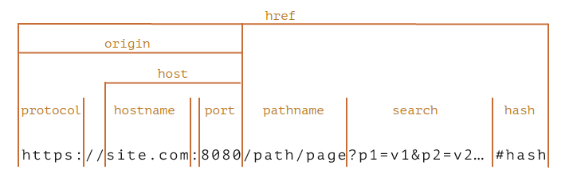
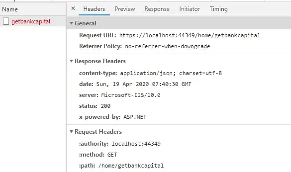
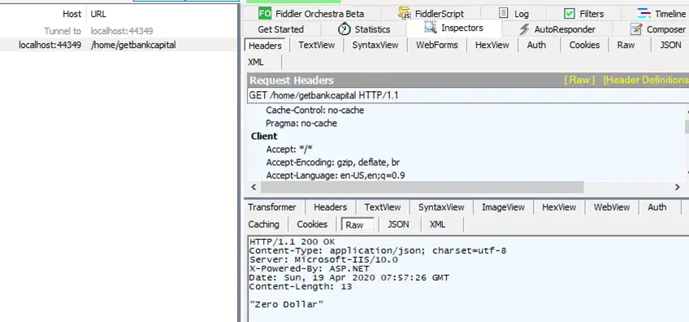
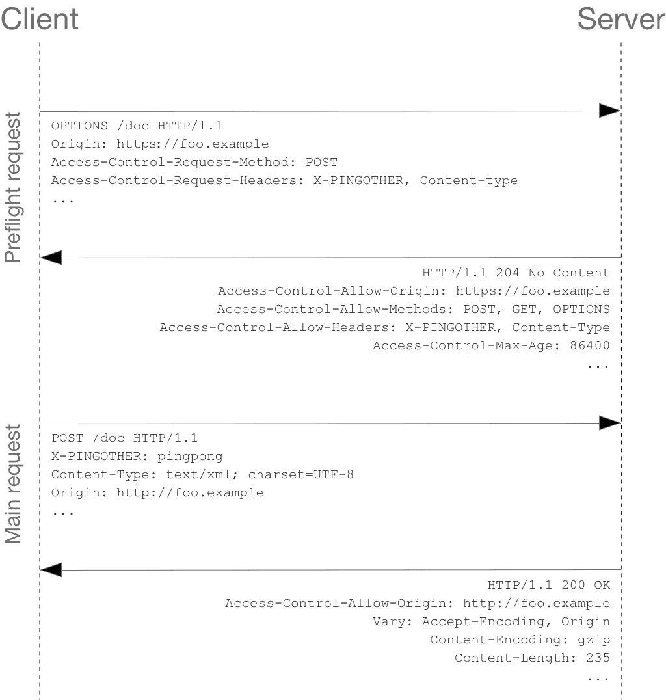
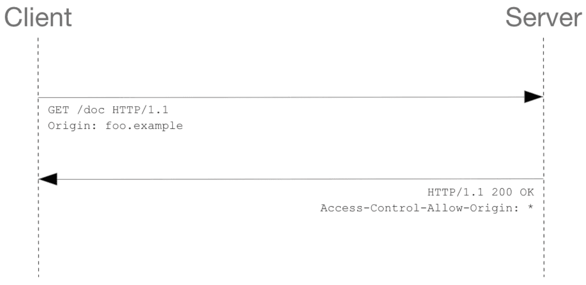

바쁘다면 4번으로 바로 갑시다.

## 1. CORS?

웹 브라우저에서 리소스를 요청하려면 아래 두가지 정책을 지켜야 한다.

1. **SOP (Same-Origin Policy)**
    
    같은 출처끼리 리소스를 공유할 수 있다는 정책
    
2. **CORS 정책 (Cross-Origin Resource Sharing)**
    
    다른 출처끼리의 리소스 공유를 제한하는 정책
    

### 출처(Origin)



- Protocol, host, port를 합친 것
    - port가 명시되지 않았다면 기본 포트 지정
        - :80 (http)
        - :443 (https)
- 출처가 같다는 것의 의미는 위 3가지가 같다는 것

## 2. 왜 이런 정책을 적용할까?

### SOP의 필요성

SOP는 JavaScript가 인터랙션하는 컨텐츠에 대한 제약 사항으로서, 웹 브라우저 초기부터 도입된 기초적인 보안책이다. JavaScript는 브라우저의 통제 하에 있다. JavaScript는 DOM에 접근 시 브라우저의 DOM API, 서버와 통신 시 브라우저의 XMLHttpRequest 등을 사용하기 때문에, 이를 통해 브라우저가 JavaScript에 제약을 가할 수 있다.

- 브라우저는 스크립트가 DOM API를 통해 DOM에 접근하려 할 때, 동일 origin에서 불러온 문서 객체만 읽고 변경할 수 있도록 허용한다.
    
    ex) 내부에 iframe을 가지고 있는 문서의 스크립트에서, origin이 다른 iframe의 DOM을 읽으려 하면 에러를 발생시킴
    
- 브라우저는 스크립트가 XMLHttpRequest 객체를 통해 HTTP 요청을 보낼 때 SOP 준수 여부를 확인한다.
    
    ex) 다음 예시에서 설명
    

보안에 취약한 은행사이트가 하나 있고, 이 곳을 털어먹으려는 악의적인 사이트가 있다고 해보자. 은행사이트 서버에 `/Home/GetBankCapital`을 호출하면 은행의 자본을 얻을 수 있는 API가 있다고 가정하자.

```java
public IActionResult GetBankCapital(){    return Json(“Zero Dollar”);}
```

악의적인 사이트에서 위 URI로 아래와 같은 요청을 보냈을 때

```jsx
function getBankCapital(uri) {
    fetch(uri)
        .then(response => response.json())
        .then(data => alert(data))
        .catch(error => alert(error));
}
```

브라우저 SOP/CORS 정책에 의해 응답의 내용을 확인할 수 없지만 코드는 200이 왔다.


<figcaption align="center"><i>콘솔</i></figcaption>




<figcaption align="center"><i>헤더 상세</i></figcaption>

보안이 취약한 서버에서는 실제로 응답을 보내준 것이다. 아래에서 서버쪽 응답을 모니터링한 것을 보면 “Zero Dollar”를 정상 return해준 것을 볼 수 있다.



서버에서 응답이 정상으로 이뤄졌어도, 브라우저 단에서 SOP 정책을 통해 보안 리스크를 막아줄 수 있었다.

### CORS의 필요성

현실적으로 같은 출처끼리만 리소스를 공유하는 것이 불가능하기 때문에, 브라우저에서는 정책에 따라 안전한 사이트 여부를 확인해 허용하는 과정이 도입되었다.

## 3. CORS 동작 방식

CORS가 동작하는 방식은 3가지 시나리오에 따라 변경된다. 하나씩 알아보면서 CORS 정책을 준수하는 방법들을 확인해보도록 한다.

### Preflight 방식

요청이 발생하면 브라우저는 아래 두개의 요청을 서버로 보낸다.

1. Preflight 요청: `OPTIONS` 메서드를 사용해 CORS 정책에 부합하는지 먼저 확인하는 과정
2. 본 요청
    
    
    

Preflight 요청 헤더에 요청 내용들을 담아서 보내면, 서버는 허용 및 금지 정책을 넣어 응답해 준다.

브라우저는 요청과 응답의 정책들을 비교하여 안전하다고 판단 시 본 요청을 보낸다.

### Simple Request

대부분은 Preflight 방식을 사용하지만, 본 요청 한 번 만으로도 CORS 정책 위반 여부를 검사하기도 한다.



Preflight 요청을 보내지 않고 본 요청부터 보내면 서버가 응답 헤더에 CORS 관련 헤더를 넣어주고, 브라우저가 이를 받아서 위반 여부를 확인하는 방식이다.

하지만 특정 조건들을 만족하는 경우에만 예비 요청을 생략할 수 있다.

1. GET / HEAD / POST 중 하나의 메서드일 때
2. 유저 에이전트가 자동으로 설정한 헤더 외에 수동으로 설정할 수 있는 헤더가 아래 뿐인 경우
    - [Accept](https://developer.mozilla.org/ko/docs/Web/HTTP/Headers/Accept)
    - [Accept-Language](https://developer.mozilla.org/ko/docs/Web/HTTP/Headers/Accept-Language)
    - [Content-Language](https://developer.mozilla.org/ko/docs/Web/HTTP/Headers/Content-Language)
    - [Content-Type](https://developer.mozilla.org/ko/docs/Web/HTTP/Headers/Content-Type) (아래의 추가 요구 사항..)
    - Range
3. [Content-Type](https://developer.mozilla.org/ko/docs/Web/HTTP/Headers/Content-Type) 헤더를 쓰는 경우 다음의 값들만 허용
    - application/x-www-form-urlencoded
    - multipart/form-data
    - text/plain

그러나 위 조건들을 모두 만족하기는 매우 어렵다. 두 번째 조건만 봐도, 특정 헤더들 이외 추가적인 헤더를 사용하지 않기는 현실적으로 힘들다. 세 번째 역시 대부분의 HTTP API는 **`text/xml`**이나 **`application/json`** 컨텐츠 타입을 가지도록 설계되기 때문에 조건을 맞추기 어렵다.

### Credentialed Request

XMLHttpRequest객체나 fetch ****API를 사용할 때, **credentials** 관련 옵션을 특정하게 설정한 경우, 인증과 관련된 CORS 정책들을 충족시켜야 한다.

🧡 이 옵션을 사용해야 하는 경우는 crendential을 필요로 하는 요청을 보낼 때이다. crendential란 cookie와 `Authorization` 헤더를 의미한다.

```java
/* fetch API */fetch("https://example.com:1234/users", {  credentials: "include",})
```

fetch API에서 `credentials`의 옵션 값은 세가지이다.

| same-origin (기본값) | 같은 출처 간 요청에만 credential을 담을 수 있다. |
| --- | --- |
| include | 모든 요청에 credential을 담을 수 있다. |
| omit | 모든 요청에 credential을 담을 수 없다. |

XMLHttpRequest를 쓰는 경우 `true`를 주면 fetch API에서의 `include`를 설정한 것과 동일하다.

```jsx
const xhr = new XMLHttpRequest();
xhr.open('GET', 'http://example.com/', true);
xhr.withCredentials = true;
xhr.send(null);
```

credential을 요청에 포함해야하는 경우,

fetch API라면 credentials 옵션 값으로 `same-origin`, `include`를 사용하고,

XMLHttpRequest라면 `withCredentials`를 true로 설정한다.

## 4. CORS 에러 대처하기

발생되는 에러 문구들을 보면서 CORS 정책을 알아보자.

### Access-Controll-Allow-Origin 관련 에러

> 🚫 No ‘Access-Control-Allow-Origin’ header is present on the requested resource.
> 

서버에서 보내준 응답 헤더 `Access-Control-Allow-Origin`은 *(와일드 카드)거나 요청된 `origin`과 동일해야 브라우저가 본 요청을 전송한다. 브라우저가 봤을 때 이 값이 없거나, 요청 헤더의 `origin`과 같지 않으면 해당 오류가 발생한다.

확인해 볼 수 있는 부분은 아래와 같다.

- 서버가 허용하는 `origin`이 아닌지
    - 서버에서는 이 값을 확인하고 허용되는 origin이면 `Access-Control-Allow-Origin`의 값에 value로 사용한다.
- 서버에서 요청 헤더 안에 `origin`을 제대로 받았는지
    - CDN이 있는 경우 최초 요청의 `origin` 헤더가 원본 서버로 잘 전달되었는지 의심해볼 수 있다.

### Access-Control-Allow-Headers 관련 에러

> 🚫 Request header field *** is not allowed by Access-Control-Allow-Headers in preflight response.*
> 

Preflight 요청에서는 `Access-Control-Request-Headers`의 값으로 본 요청에 이런 헤더들을 보낼 것이라고 미리 알려준다.

브라우저는 서버가 `Access-Control-Allow-Headers` 에 동일한 값을 넣어 전달해줬는지 대조한다.

이런 경우 확인해보자.

- 요청 시 `Access-Control-Request-Headers`가 포함되었는데 응답에는 `Access-Control-Allow-Headers`가 존재하는지
- 요청 때 보낸 헤더 목록과 응답 때 온 값이 다른지
- 서버가 `Access-Control-Allow-Methods`에 OPTIONS를 보내지 않았는지

### Credentials 관련 에러

⇒ 위 [Credentialed Request](https://www.notion.so/fc23d9a90a104f2a83e568cfe32ccda9) 설명 참고

> 🚫 The value of the ‘Access-Control-Allow-Origin’ header in the response must not be the wildcard ’’ when the request’s credentials mode is ‘include’.*
> 

Credentials mode가 `include`로 설정된 상태이다.

서버가 `Access-Control-Allow-Origin`: * ****를 주면 CORS 정책에 위반되므로 구체적인 origin을 줘야한다.

> 🚫 Access Control Allow Credentials header in response is ’ ’ which must be ‘true’ when the request credentials mode is ‘include’.
> 

Credentials mode가 `include`로 설정된 상태이므로,

응답 헤더에 `Access-Control-Allow-Credentials`: true ****가 반드시 포함되어 있어야 한다.

### 요청-응답 예시

```
...
access-control-request-headers: x-tracking-id, x-application
access-control-request-method: GET
origin: https://class101.net
...
```

Origin 뿐 아니라 본 요청에 들어갈 다른 정보들도 헤더로 들어간다.

이에 대한 응답도 살펴보자.

```
...
access-control-allow-credentials: true
access-control-allow-headers: x-tracking-id, x-application
access-control-allow-methods: GET,HEAD,PUT,PATCH,POST,DELETE
access-control-allow-origin: https://class101.net
vary: Origin, Access-Control-Request-Headers
...
```

- vary: 요청에 따라서 서버에서 응답하는 값이 달라지는 요청 헤더들 목록

### 추가로 알아둘 부분

Preflight 요청이 200을 응답 받았더라도,

CORS 정책 위반 여부를 판단하는 시점은 예비 요청에 대한 응답을 받은 이후이기 때문에, 위반 시 CORS 에러를 관찰할 수있다.

---

## Reference

- [https://developer.mozilla.org/ko/docs/Web/HTTP/CORS](https://developer.mozilla.org/ko/docs/Web/HTTP/CORS)
- [https://evan-moon.github.io/2020/05/21/about-cors/#cors는-어떻게-동작하나요](https://evan-moon.github.io/2020/05/21/about-cors/#cors%EB%8A%94-%EC%96%B4%EB%96%BB%EA%B2%8C-%EB%8F%99%EC%9E%91%ED%95%98%EB%82%98%EC%9A%94)
- [SOP의 존재 이유를 예시로 잘 설명한 글](https://medium.com/@zhaojunemail/sop-cors-csrf-and-xss-simply-explained-with-examples-af6119156726)
- [Credentials에 대해 자세하게 설명한 글](https://junglast.com/blog/http-ajax-withcredential)