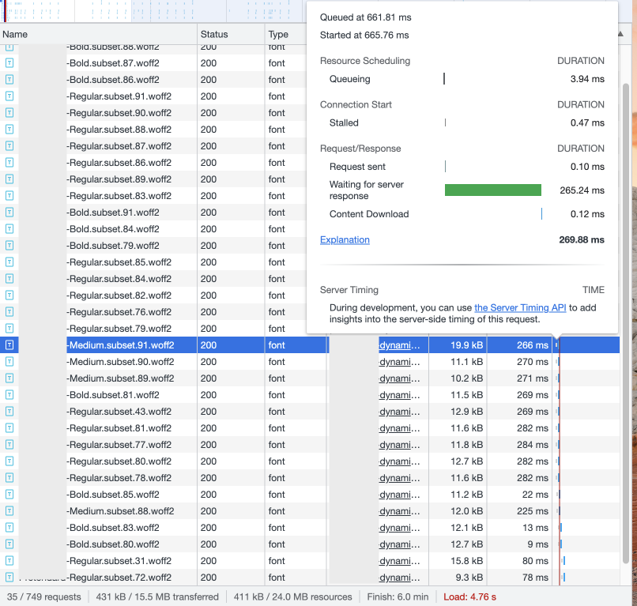
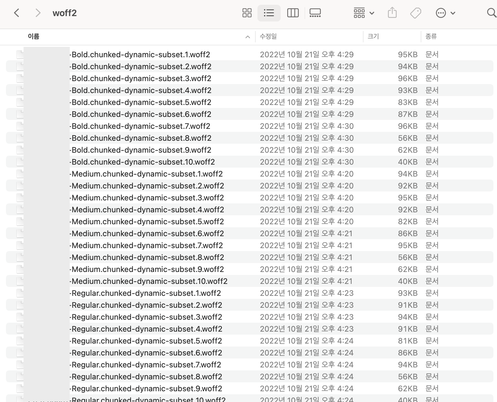

### 폰트 관련 용어 사전 설명

| 용어 | 설명 |
| --- | --- |
| woff, woff2 | Web Open Font Format. 압축률이 좋아 web에서 다운받아 사용하기에 최적화된 웹폰트 파일 형식. woff2는 woff보다 압축률이 30~50% 더 좋으며 모든 브라우저의 최신 버전에서 지원 |
| subset | 1개 폰트 파일 내 글자들의 일부를 떼어내 작게 쪼개 놓은 파일 |
| dynamic subset | 폰트의 글자들을 여러 벌의 subset 파일으로 작게 쪼개두고, 페이지에 보여줄 글자들이 있는 파일만 요청하는 방식.<br>용량이 큰 폰트 파일을 한 번에 다운 받는 것을 피하기 위해 고안됨.<br>ex. Home 화면에서 쓰이는 글자가 ‘가, 바, 사’ 3개 뿐이라고 가정했을 때, 해당 3글자가 포함된 font 파일 조각만 요청하는 것 |

## 문제 발견

우리 회사 사이트는 위에서 설명한 dynamic subset 방식을 쓰고 있다.

주요 페이지 중 한 곳에서 35개의 woff2 요청이 전송되고 있는데, 개수가 많다보니 대기 시간이 길어지고, 서버 응답이 지연된다. 아래의 경우 19.9kb 폰트를 다운로드하는 속도는 0.12ms로 굉장히 짧지만 응답 대기 시간이 265.24ms으로 길다.



## 개선 방법 찾기

1. 처음엔 아예 dynamic subset 방식을 버리고, 우리가 쓰고 있는 폰트의 original 버전에서 불필요한 글꼴을 줄여 경량화된 subset 버전을 쓰고자 했다.
    - 단점은 이 또한 사이즈가 크다는 것이었다. 한 파일 당 270KB 정도이고, 우리는 3개 파일을 쓰기 때문에 이렇게 되면 첫 로드 시 810KB 정도를 요청하게 된다.
2. 따라서 dynamic subset 방식은 그대로 쓰되, 폰트 한 종류 당 92개(한글), 120개(일본어)였던 subset 파일들을 각각 10개로 줄이는 것으로 방법을 바꾸었다.

## 커스텀 과정

직접 과정을 밟아보자. [Google Fonts](https://fonts.google.com/specimen/Roboto)에서 테스트 대상 폰트의 woff2 파일과 dynamic subset css 파일을 받아볼 수 있겠다.

### Dynamic subset 만들기

1. python이 있어야 하고, 몇가지 라이브러리를 설치해야한다.
    - python
        - fonttools : subset을 커스텀으로 만들 수 있는 라이브러리
        - brotli : 구글의 웹폰트 압축 알고리즘. woff2를 만들기 위해 필요
    
    ```bash
    pip install fonttools brotli
    ```
    
2. 유니코드에 따라 subset 요청을 정의해둔 css 파일([참고](https://fonts.googleapis.com/css2?family=Noto+Sans+KR:wght@900&display=swap))에서 각 subset의 unicode-range 값들만 추출한다.
    
    ```css
    /* [0] */
    @font-face {
    	...
    	unicode-range: U+f9ca-fa0b, U+ff03-ff05, U+ff07, ...;
    }
    /* [1] */
    @font-face {
    	...
    	unicode-range: U+d723-d728, U+d72a-d733, ...;
    }
    /* [2] */
    ```
    
    ```tsx
    /* 한글은 92개 subset으로 나뉘어 있었으니, 배열 아이템은 92개가 나온다. */
    const unicodeGroups = [
      'U+d723-d728,U+d72a-d733,U+d735-d748,U+d74a-d74f,U+d752-d753,U+d755-d757,U+d75a-d75f,U+d762-d764,U+d766-d768,U+d76a-d76b,U+d76d-d76f,U+d771-d787,U+d789-d78b,U+d78d-d78f,U+d791-d797,U+d79a,U+d79c,U+d79e-d7a3,U+f900-f909,U+f90b-f92e',
      'U+d679-d68b,U+d68e-d69e,U+d6a0,U+d6a2-d6a7,U+d6a9-d6c3,U+d6c6-d6c7,U+d6c9-d6cb,U+d6cd-d6d3,U+d6d5-d6d6,U+d6d8-d6e3,U+d6e5-d6e7,U+d6e9-d6fb,U+d6fd-d717,U+d719-d71f,U+d721-d722',
      'U+d5bc-d5c7,U+d5ca-d5cb,U+d5cd-d5cf,U+d5d1-d5d7,U+d5d9-d5da,U+d5dc,U+d5de-d5e3,U+d5e6-d5e7,U+d5e9-d5eb,U+d5ed-d5f6,U+d5f8,U+d5fa-d5ff,U+d602-d603,U+d605-d607,U+d609-d60f,U+d612-d613,U+d616-d61b,U+d61d-d637,U+d63a-d63b,U+d63d-d63f,U+d641-d647,U+d64a-d64c,U+d64e-d653,U+d656-d657,U+d659-d65b,U+d65d-d666,U+d668,U+d66a-d678',
      ... 89 more
    ];
    ```
    
3. 그룹핑을 다시 한다. (개인의 기준에 맞게…)
    1. 한글: 92개 그룹을 9개씩 앞에서 순차적으로 병합해서 10개 그룹으로 만든다. 
    (9개씩 병합하면 총 11개 파일이 나오는데, 용량이 작은 8번째와 11번째 파일을 한 번 더 합쳐 10개로 만들었다.)
    2. 일본어: 그룹끼리 병합하면 너무 커지는 파일들이 많아서, unicode range 단위로 쪼개준 다음에 균등하게 10개로 나눴다.
        
        ```tsx
        const { chunk } = require('lodash');
        
        const unicodes = unicodeGroups.join(',').split(',');
        const chunks = chunk(unicodes, unicodes.length / 10 + 1);
        ```
        
4. CLI로 실행할 command를 작성한다.
    1. fonttools 라이브러리를 설치하면 pyftsubset로 시작하는 CLI command를 쓸 수 있다. 
        
        ```bash
        pyftsubset MyFont-Regular.woff2
         --unicodes=U+d105-d12f,U+d132-d133,U+d135-d137,U+d139-d13f # 포함시킬 unicode range
         --output-file=MyFont-Regular.chunked-dynamic-subset.1.woff2 # 아웃풋 파일명
         --flavor=woff2 # 이 옵션으로 포맷을 넣어줘야 포맷에 맞게 압축이 된다.
        ```
        
    2. 위 3번에서 만든 그룹을 기준으로 command를 뽑았다.
        
        ```tsx
        const names = ['MyFont-Regular', 'MyFont-Medium', 'MyFont-Bold'];
        
        /*
        폰트 서브셋 생성 command
        */
        const commands = names
          .map(name =>
            chunks
              .map(
                (chunk, i) =>
                  `pyftsubset ${name}.woff2 --unicodes=${chunk.join(',')} --output-file=${name}.chunked-dynamic-subset.${
                    i + 1
                  }.woff2 --flavor=woff2`
              )
              .join('\n\n')
          )
          .join('\n');
        
        console.log(commands);
        ```
        
5. 커맨드 실행 결과
    
  
    

### CSS 파일 생성하기

위에서 그룹핑한 chunks로 font-face를 작성해 CSS 파일을 생성한다. 

브라우저는 이 CSS 파일을 읽고 페이지에 필요한 폰트의 @font-face 지시어 내에 정의된 src url로 요청을 보낸다.

- 생성 코드
    
    ```tsx
    const fs = require('fs');
    
    const copyright = `/*
    Copyright (c) ....
    */`;
    
    const fontName = 'MyFont';
    const fontStyles = [
      ['Regular', 400],
      ['Medium', 500],
      ['Bold', 700],
    ];
    
    const fontFaces = fontStyles.map(([type, weight]) =>
      chunks
        .map(
          (unicodeList, i) => `
    /* ${i + 1} */
    @font-face {
      font-family: 'MyFont';
      font-style: normal;
      font-display: swap;
      font-weight: ${weight};
      src: url(./woff2-chunked-dynamic-subset/${fontName}-${type}.chunked-dynamic-subset.${
            i + 1
          }.woff2) format('woff2'), url(./woff-chunked-dynamic-subset/${fontName}-${type}.chunked-dynamic-subset.${
            i + 1
          }.woff) format('woff'); 
      unicode-range: ${unicodeList.join(',').split(',').join(', ')}
    }` 
        ) // src 두번째는 fallback으로 woff 포맷 파일도 넣어준 것이다.
        .join('')
    );
    
    const css = copyright + fontFaces.join('');
    
    fs.writeFileSync(`${fontName}-chunked-dynamic-subset.css`, css);
    ```
    

## 요청 보내기

1. 만들어낸 css 파일과 woff2 파일을 S3 등의 저장소에 업로드한다.
    - 폰트가 자주 바뀌지 않는다면, 브라우저 메모리와 CDN에 캐싱되도록 위 파일들의 응답 헤더에 `max-age`, `s-maxage` 등을 설정하자.
2. html에서 보내는 폰트 css 파일을 새롭게 만든 파일로 변경한다.
    
    ```html
    <link
      href="https://cdn.xxxx.xxx/fonts/xxxx/xxxx-chunked-dynamic-subset.css"
      rel="preload"
      as="style"
    />
    ```
    

## Rereference

**최적화 관련**

[https://web.dev/i18n/ko/reduce-webfont-size/](https://web.dev/i18n/ko/reduce-webfont-size/)

[https://d2.naver.com/helloworld/4969726](https://d2.naver.com/helloworld/4969726)

**라이브러리 관련**

[https://www.44bits.io/ko/post/optimization_webfont_with_pyftsubnet](https://www.44bits.io/ko/post/optimization_webfont_with_pyftsubnet)