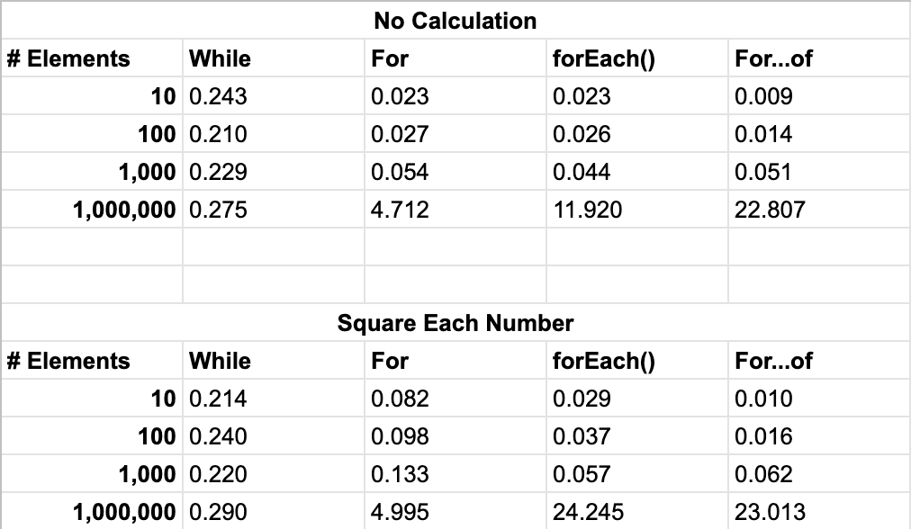

- Reference
    - [https://medium.com/@Bigscal-Technologies/which-type-of-loop-is-fastest-in-javascript-55cc1845f5de](https://medium.com/@Bigscal-Technologies/which-type-of-loop-is-fastest-in-javascript-55cc1845f5de)
    - [https://betterprogramming.pub/which-is-the-fastest-while-for-foreach-for-of-9022902be15e](https://betterprogramming.pub/which-is-the-fastest-while-for-foreach-for-of-9022902be15e)

어떤 loop이 퍼포먼스를 해치지 않으면서 니즈를 충족할 수 있을까?

## 뭐가 제일 빠른가?

- 100만 개의 값을 가진 배열을 한 번 돌렸을 때..

```jsx
const million = 1000000;
const arr = Array(million);
console.time(‘⏳’);

for (let i = arr.length; i > 0; i--) {} // for(reverse) :- 1.5ms
for (let i = 0; i < arr.length; i++) {} // for :- 1.6ms
arr.forEach(v => v) // foreach :- 2.1ms
for (const v of arr) {} // for…of :- 11.7ms

console.timeEnd(‘⏳’);
```
### 데이터 크기 및 연산 여부에 따라 다름



## 각각의 loop을 언제 사용하면 좋을까?

1. While
    - 스케일이 큰 배열을 처리할 때 성능 굿
2. For loop (forward & reverse)
    - 특정한 카운트가 필요할 때
3. forEach
    - *forEach*의 callback 함수는 현재 값과 index를 받으며, 함수 안에서 쓰일 this를 optional parameter로 허용
    - 위와 같이, iteration에 대한 값이 필요하거나 this 등을 설정하는 등 제어가 필요할 때
    - 각 원소마다 callback에서 일을 벌릴 수록 큰 폭으로 느려짐
4. For …of
    - 가독성 있는 반복문이 필요할 때, map이나 set 등등 다양한 iteration object를 순회할 때
    - 데이터의 크기가 작을 때는 1등, 클 때는 꼴찌
5. For …in
    - 유저가 property를 직접 정의한 object를 순회할 때
    - 왜 느린가?
        - Object의 모든 property에 숫자 index를 부여하고 그 순서로 순회한다.
        - 이런 이유로 애초에 숫자 index가 key인 array를 도는 for…of가 더 빠르다.

**for forward vs reverse**
- for loop 중에서는 평균적으로 가장 빠른 속도
- for 회수 *forward*(가산) 방식과 *reverse*(감산) 방식은 소요시간에 큰 차이는 나지 않는다. reverse 방식은 초기 변수 `let i = arr.length` 딱 1회만 연산하기 때문에 0.1ms 차이가 있다. forward 방식에서 가산을 할 때마다 `i < arr.length` 조건을 검증한다. 큰 차이 없으므로 무시해도 된다.
- 반면, *forEach*는 array 프로토타입의 메서드다. 일반적인 for loop과 비교한다면 *forEach*나 *for…of*는 배열을 순회하기에 더 오래 걸린다.

## 결론

- *while* : 큰 값을 다룰 때 가장 빠름.
- *for…of* : 데이터 크지 않으면 제일 빠름. 데이터 크면 느림. 가독성 좋음.
- *for* : for loop 중에는 전반적으로 제일 빠름. 가독성은 낮음.
- *foreach :* 데이터 크지 않으면 빠름. 반복을 쉽게 제어할 수 있음.
- *for…in* : 느림. 굳이 순회?

### 느낀 점

- 사실상.. 데이터가 크지 않을 땐 속도 차이가 작다. **가독성**에 집중하자.
- 데이터의 크기가 커지거나 연산이 복잡해지면 무시할 수 있는 차이는 아니다.
- Client side에서 큰 데이터를 다루지 않도록 페이지네이션 등 optimization이 우선이다.

### Next step

Array object의 메서드인 reduce, map, filter, some 등의 속도 비교 해보기