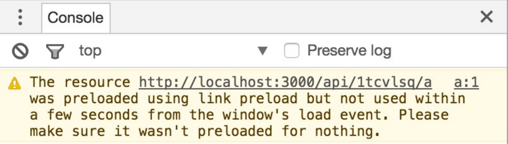

브라우저가 내가 원하는 순서로 resource를 가져와 캐싱하게끔 할 수 있다. 현재 문서와 외부 리소스와의 관계를 정의하는 link 태그에 preload, prefetch라는 속성값을 사용하는 것이다.

**사용 예시**

```tsx
<link 
	rel="preload" 
	href="myFont.woff2" 
	as="font" 
	type="font/woff2" 
	crossorigin="anonymous"
>
```

## preload VS prefetch - 용도 차이

- `preload`: **현재 페이지** **탐색에 사용할 리소스**를 빠르게 사용하기 위함
- `prefetch`: 현재 페이지로부터 연결될 **다음 페이지에서 사용할 리소스**를 빠르게 사용하기 위함

## preload

- `preload` 속성을 통해 특정 리소스를 명시하면, document의 리소스 로드 과정에서 **가장 우선 요청하고 캐시한다**.
- 어떤 리소스가 페이지를 로딩하고 나서 최대한 빨리 필요한 경우에 쓴다.

```html
<link rel="preload" href="myFont.woff2" as="font" type="font/woff2" crossorigin="anonymous">
```

## prefetch

- `prefetch` 속성을 통해 특정 리소스를 명시하면 백그라운드에서 요청한다. (낮은 우선순위로 처리됨)

```html
<link rel="prefetch" href="style.css">
```

 

## 사용자의 데이터를 낭비할 수도 있지 않을까?

리소스가 cacheable하지 않으면 사용자의 데이터를 낭비할 수 있다는 리스크가 있다.

document의 onload가 끝나고 3초 안에, 미리 불러온 리소스가 쓰이지 않으면 Chrome은 콘솔에 경고 메시지를 띄운다. 퍼포먼스를 개선하려고 굳이 미리 불러왔는데 빠르게 쓰지를 않는다면, 필요 없는 작업을 했을 뿐더러 사용자의 데이터를 낭비하는 일일 뿐이다.



## 기타 알아둘 사항

- 리소스는 prefetch, preload를 통해 먼저 불러와지면 그저 캐싱이 될 뿐이다. 바로 실행되거나 적용되는 게 아니다.
- 두 속성값과 함께 쓰이는 `as`
    - preload 또는 prefetch 특성을 지정했을 때만 사용. `<link>` 요소가 불러오는 콘텐츠의 유형을 지정
    - [사용 가능한 값들](https://developer.mozilla.org/ko/docs/Web/HTML/Element/link#attr-as)
- 같은 리소스를 중복으로 불러오는 경우(double fetch)가 있어 주의가 필요하다.
    - preload의 fallback으로 prefetch를 쓰는 경우
    - 폰트를 preload할 때 crossorigin ****속성을 안 쓰는 경우
    - script를 preload할 때 as를 안 쓰는 경우 (이외에도 as를 안 쓰면 preload의 이점을 못 누릴 수 있음)
    

## References

- [https://stackoverflow.com/questions/52764401/what-are-the-differences-between-html-preload-and-prefetch](https://stackoverflow.com/questions/52764401/what-are-the-differences-between-html-preload-and-prefetch)
- [https://medium.com/reloading/preload-prefetch-and-priorities-in-chrome-776165961bbf](https://medium.com/reloading/preload-prefetch-and-priorities-in-chrome-776165961bbf)