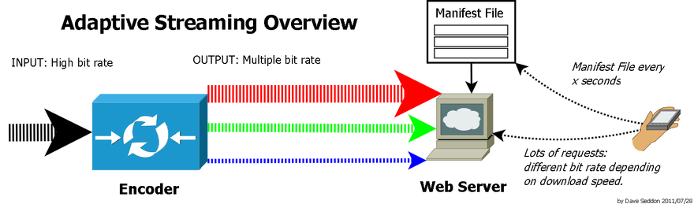

Modern Web에 주로 쓰이는 비디오 streaming 방식에 대해 살펴보자.

## Progressive video streaming

비디오 파일 하나를 인터넷을 통해 스트림하는 것이다.

이런 타입의 파일은 주로 mp4 포맷으로 많이 제공되고, 물론 다른 포맷들도 많이 존재한다. 스크린 사이즈에 대응해 늘어나거나 줄어들 순 있지만 디바이스가 작든 크든 1개 파일이 제공된다.

### 단점

1. 품질 문제: 스크린 사이즈보다 좀 더 규격이 작은 비디오 파일이 재생된다고 하면, 파일을 스크린에 맞춰 늘려 재생하기 때문에 퀄리티 유지를 할 수 없다.
2. 버퍼링 문제: 인터넷 연결이 좋지 않은 유저의 경우는 재생이 끊긴 상태에서 데이터를 기다렸다가 다시 시작한다.

## **Adaptive video streaming**

연결 상태, 플레이어, 디바이스 상관 없이 최고의 품질과 영상 경험을 제공한다.

Adaptive Bitrate Streaming을 줄여 ABR이라고 하며, 이런 타입의 스트리밍은 절대다수가 HTTP를 베이스로 한 기술들이다. 
(ex. 전송 프로토콜: MPEG DASH, Apple’s HLS, Microsoft Smooth Streaming)

### ABR이 어떻게 progressive streaming을 뛰어 넘었을까?

1. 품질
    
    스크린 사이즈에 맞게 비디오 파일을 생성할 수 있다. 
    
    스크린 사이즈에 맞춘 비디오 파일을 송출할 수있고, 유저는 언제나 좋은 품질의 영상을 시청할 수 있다.
    
2. 버퍼링
    
    유저가 비디오를 빠르게 다운로드할 수 없는 상황에서는 일어날 수밖에 없다. 

    흔히 비디오는 초당 24 프레임으로 재생되는데, 버퍼링을 피하려면 인터넷 커넥션은 최소 24프레임을 매초 다운로드해야 한다.

    Adaptive streaming은 유저의 인터넷 속도에 “반응”하는 방식으로 이 문제를 해결한다.

    간략하게 설명하면, 덩치가 작은 비디오는 큰 비디오보다 빠르게 다운로드할 수 있기 때문에 느린 인터넷 환경 하에서는 작은 비디오파일 사이즈로 바꿔서 요청해 비디오 재생을 이어간다.
    

### ABR 처리 방식

요청에 따라 원본 video는 여러 bit rate 버전으로 인코딩된다.

각각의 비트레이트로 만들어진 파일은 또 다시 여러 조각으로 나눠진다. 조각의 크기는 상황에 맞게 달라질 수 있고, 보통 2-10초 단위이다. 

1. 클라이언트는 manifest 파일을 다운로드받게 된다. 나눠진 조각들에 대한 정보와 각각의 bit rate 정보 등이 기술되어 있는 파일이다.
2. 스트리밍이 시작되면 클라이언트는 가장 낮은 bit rate를 가진 조각들부터 요청한다. 
3. 네트워크 처리량이 괜찮다고 판단되면, 클라이언트는 더 높은 bit rate의 조각들을 요청한다. 처리량이 나중에 저하되면 낮은 bit rate 조각들을 요청한다.

ABR 알고리즘은 클라이언트에서 어떤 bit rate의 조각들을 다운받아야 할지 결정하는 핵심 기능을 수행한다. 알고리즘은 몇 개의 타입이 있다.

- 처리량 기반 알고리즘: 최근 처리량 기반
- buffer 기반 알고리즘: 클라이언트의 최근 buffer 수준 기반
- hybrid 알고리즘: 위 두 정보를 혼합

### Ref

- [What is Progressive Video Streaming and Adaptive Video Streaming](https://www.5centscdn.net/help/knowledge-base/what-is-progressive-video-streaming-and-adaptive-video-streaming/)
- [Wikipedia - ABR](https://en.wikipedia.org/wiki/Adaptive_bitrate_streaming)