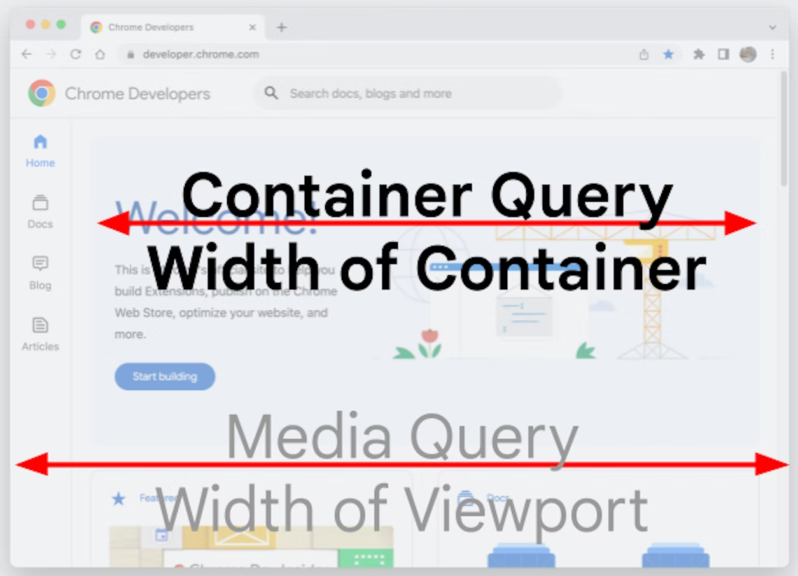
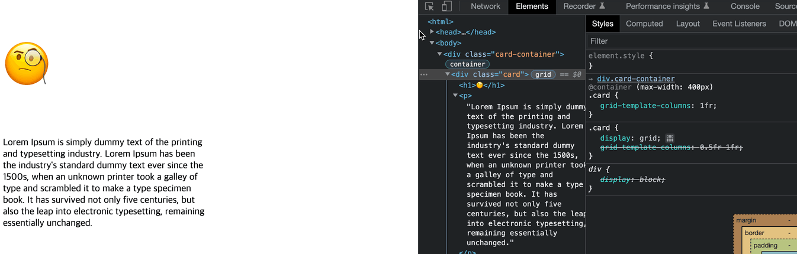
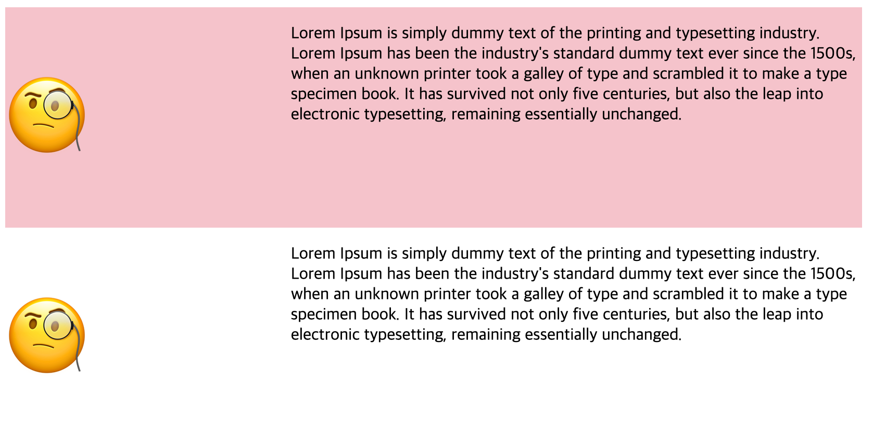

2022.8.30 Chrome 105 release 이후로 크롬에서 사용 가능하게 된 CSS 스펙 두 가지가 있는데 흥미로워 보여 어떤 것들인지 알아보았다.

## 1. Container queries

기존에는 viewport 사이즈를 기준으로 반응형을 구현했다면 (media query), 이 기능은 부모 element의 사이즈를 기준으로 반응형을 구현할 수 있게 한다.



### 사용 방법

emoji와 글이 들어 있는 카드를 만들어 보자.

1. 부모 element에 `container-type: inline-size` 설정.
    
    이제 모든 자식들은 이 컨테이너 사이즈 변경을 리스닝할 수 있다.
    
    ```css
    .card-container {
      container-type: inline-size;
    }
    ```
    
2. `@container()` query 문법으로 자식 element의 스타일을 지정한다.
    
    ```css
    .card {
      display: grid;
      grid-template-columns: 0.5fr 1fr;
    }
    
    @container (max-width: 400px) {
      .card {
        grid-template-columns: 1fr;
      }
    }
    ```
    

### 결과

.card-container 크기가 변함에 따라 .card의 @container 쿼리가 적용되는 것을 볼 수 있다.



### 의견

- 컴포넌트 기반으로 스타일을 줄 수 있어 반응형 구현의 근간을 바꿀 수 있는 기술로 보인다.
- 이제야 크롬 브라우저에도 적용된 따끈한 스펙이다. [Can I Use](https://caniuse.com/?search=container%20queries)를 지켜보고 도입을 고려하자.

## 2. `:has()` **pseudo-class**

어떤 selector의 css를 정의할 때, 특정한 자식을 가지고 있는 경우 스타일을 부여할 수 있는 가상 클래스이다. 

### 사용 방법

1. class라든지 id라든지 차이를 줄 수 있는 selector를 각 상황에서 지정한다.
    
    ```html
    <div class="card-container">
      <div class="card">
        <h1>🧐</h1>
        <p>Lorem Ipsum is ...</p>
      </div>
    </div>
    
    <div class="card-container">
      <div class="card **white-background**">
        <h1>🧐</h1>
        <p>Lorem Ipsum is ...</p>
      </div>
    </div>
    ```
    
2. `:has()` parameter 내에 구분하고 싶은 자식 selector를 특정한다.
    
    ```css
    .card-container:not(:has(.white-background)) {
      background-color: pink;
    }
    ```
    

### 결과



### 의견

- 카드 UI처럼 큰 틀은 같지만 variation이 있는 디자인을 구현할 때 잘 쓸 것 같다.
- 이 스펙 역시 아직은 쓸 수 있는 브라우저가 많이 없다.


### Reference
- [https://developer.chrome.com/blog/has-with-cq-m105](https://developer.chrome.com/blog/has-with-cq-m105/)