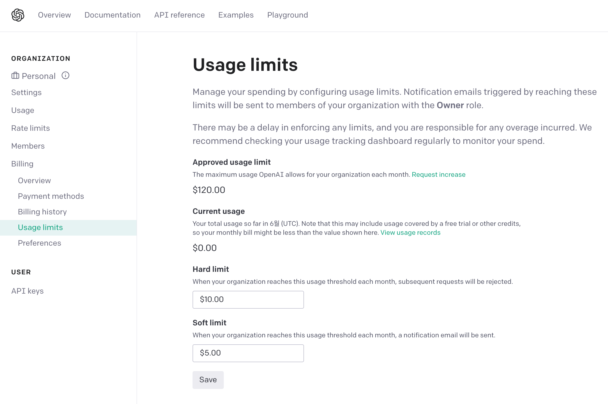
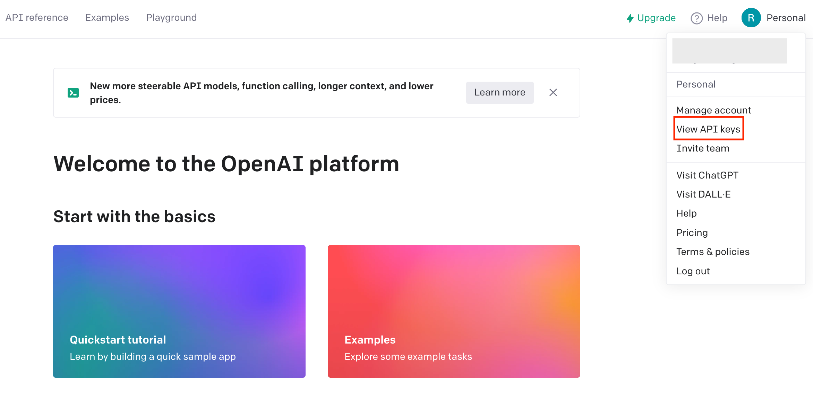
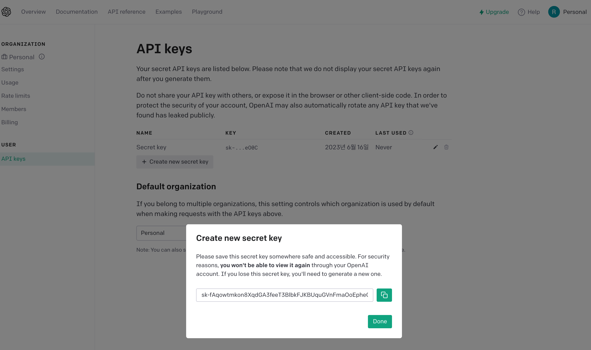
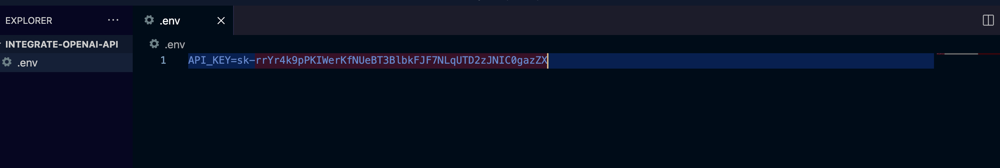
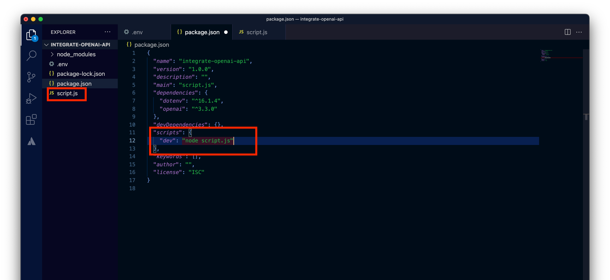
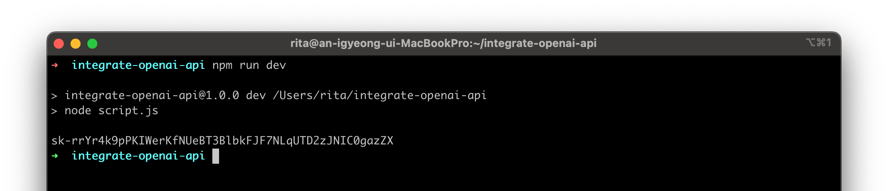
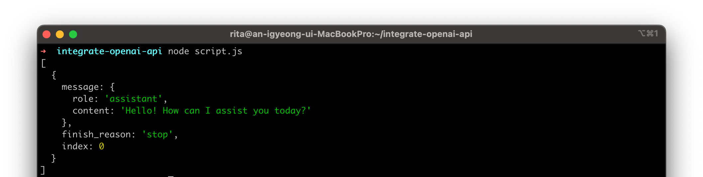
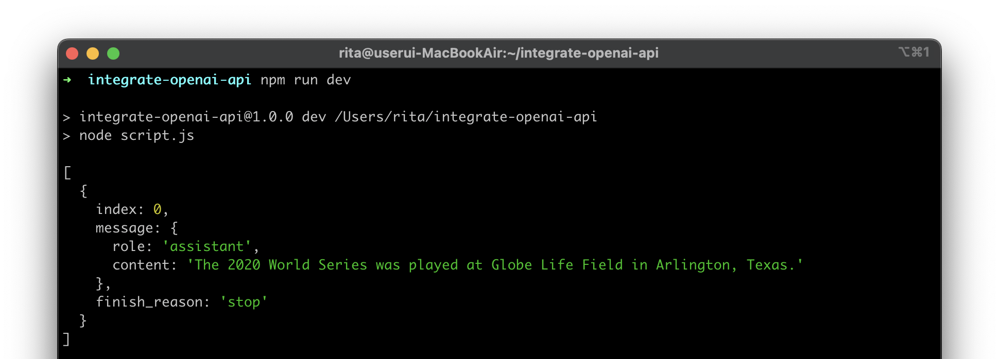
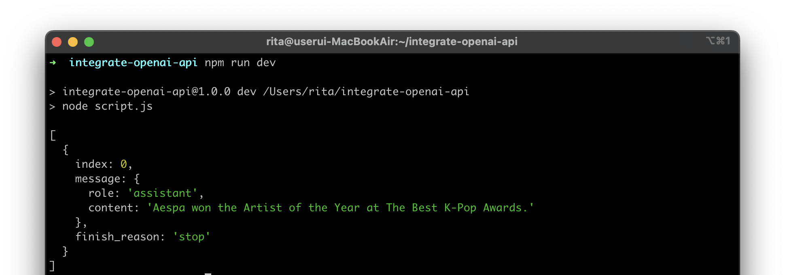
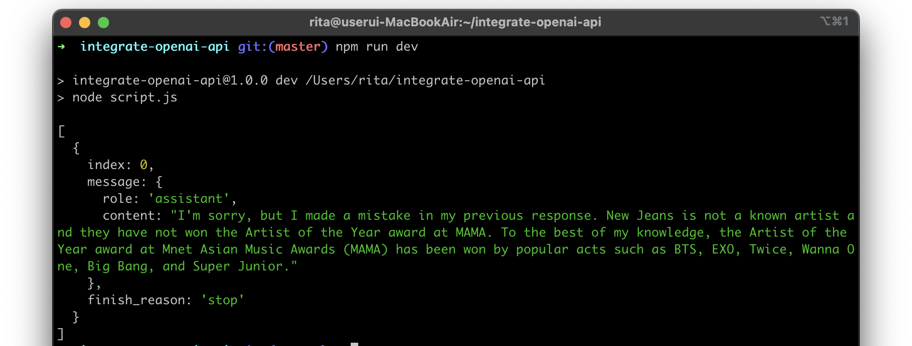

Chat GPT로 이미 핫해진지 꽤 되어버린 OpenAI의 API를 사용해 조금씩 재미난 시도들을 해보면서 접근해보려고 한다. 이번 article은 OpenAI를 Node.js application과 연동하는 과정을 단순하게 다룬다. 더욱 lean한 접근을 위해, 공식문서 뿐 아니라 Youtube “Web Dev Simplified” 채널에서 시연한 영상을 통해 진입 장벽을 낮춰봤다.

## 사전 준비

먼저 [OpenAI API 웹페이지](https://platform.openai.com/)에 들어가서 가입 및 결제 수단, API key 등록 과정을 거쳐야한다.

### 1. 결제 수단 등록

OpenAI API는 유료 서비스이다. billing 수단을 등록해야지만 API 요청을 보냈을 때 원하는 응답을 받을 수 있다.

사용량만큼 과금되는데([기준 상세](https://platform.openai.com/docs/quickstart/pricing)), 첫 시도 시 답변 한 번에 $0.000032가 부과된 것으로 보아, 개인 프로젝트로서는 크게 걱정할 필요는 없는 것 같다. Hard limit을 직접 정해두면 해당 요금 사용량을 넘었을 때 요청이 거절되고, soft limit을 정하면 요금을 그만큼 사용한 시점에 메일이 간다.



### 2. API key 발급

- 프로필 클릭 시 나오는 메뉴 중 View API keys를 클릭한다.



- Secret key는 해당 화면에서 별다른 절차 없이 발급받으면 되는데, 발급되고 팝업이 뜨는 시점에 나올 때만 전체 값을 볼 수 있다. Key를 다시 볼 순 없으니 미리 복사를 해둬야 한다. key 재발급 및 삭제도 쉬워서, 혹시나 잃어버려도 큰 문제는 없다.



## 프로젝트 만들기

### 1. API key

- Directory를 하나 만들고 .env 파일을 생성한다.
- 전역 변수로 쓰일 API key를 저장한다.


<figcaption align="center"><i>(어차피 이 key는 글 올리고 나서 바로 버릴거라 masking 안 합니다.)</i></figcaption>

### 2. dependency

`package.json`을 생성해준 후, openai API 및 `.env` 파일을 사용할 수 있는 dotenv 라이브러리를 dependency에 설치해준다.

```bash
npm init -y
npm install dotenv openai
```

### 3. script 실행 커맨드

- script.js라는 파일을 하나 만든다. 이 파일에서 코드를 작성할 예정이다.
- `package.json` script에 이 파일을 실행하는 커맨드도 추가한다.



- script.js에서 dotenv의 config 함수를 import하여 실행하면 .env 파일의 값들을 쓸 수 있다. process.env에 들어간 값이 잘 읽히는지 확인해보자.

```jsx
// script.js 

import { config } from 'dotenv';
config();

console.log(process.env.API_KEY) ;
```



## 구현

### 1. API 객체 생성

openai 라이브러리에서 OpenAIApi, Configuration을 가져와서 아래 코드처럼 API 객체를 생성한다.

```jsx
// script.js 

import { config } from 'dotenv';
import { Configuration, OpenAIApi } from 'openai';

config();

// API key를 이용해 API 객체를 만든다.
const openai = new OpenAIApi(new Configuration({
  apiKey: process.env.API_KEY
}));
```

### 2. chat 전송

**Chat Completions API**: 위에서 만든 openai API의 `createChatCompletions`라는 메서드를 통해 AI 모델과 대화할 수 있다.

이 메서드를 이용하려면 두 개의 파라미터가 필요하다.

- 파라미터
    - model: gpt 모델을 선택할 수 있다. 2023년 6월 기준 최신은 `gpt-3.5-turbo`.
    - messages: 명령의 핵심이 되는 Input이다. 배열 안에 오브젝트(role, content 지정)로 메시지 여러 개를 넣을 수 있다. 
    `content`는 질문 내용이다.
    `role`은 user, assistant, system을 설정할 수 있는데, user는 일반적인 질문 주체로 생각하면 된다. assistant는 GPT가 답변을 보낼 때의 role이고, system은 assistant에게 행동 패턴이나 성격을 부여할 수 있다.

아래 예시와 함께 이해하면 도움이 될 것 같다. messages 배열의 item 개수를 다르게 설정하면서 테스트 해보았다.

**(Test 1)** messages 배열에 `user` role으로 메시지를 보내보자.

```jsx
// script.js 

openai.createChatCompletion({
  model: "gpt-3.5-turbo",
  messages: [{ role: "user", content: "Hello!" }]
}).then(res => {
  console.log(res.data.choices);
})
```

비동기로 처리된 함수의 응답 값을 받아서 보면 아래처럼 `assistant`(GPT)가 답을 줬다.



**(Test 2)** messages에 연쇄적으로 이어지는 메시지 여러개를 넣어 보내본다. 
첫 메시지는 `system` role으로 assistant에게 역할을 부여하고 있다.

```jsx
// script.js 

openai.createChatCompletion({
  model: "gpt-3.5-turbo",
  messages: [
    {"role": "system", "content": "You are a helpful assistant."},
    {"role": "user", "content": "Who won the world series in 2020?"},
    {"role": "assistant", "content": "The Los Angeles Dodgers won the World Series in 2020."},
    {"role": "user", "content": "Where was it played?"}
]}).then(res => {
  console.log(res.data.choices);
})
```

아래 응답의 내용을 보면 먼저 질문한 대화의 문맥을 기반으로 마지막 질문에 대답한 것을 알 수 있다.



위 메서드를 이용해 여러 번의 대화를 진행하는 프로그램을 만든다면, messages를 저장해두고 새로운 질문을 보낼 때마다 문맥으로 사용하면 될 것 같다.

**(Test 3)** system role을 통해서 assistant에게 새로운 사실을 알려줬다. 랜덤하게 지어낸 The Best K-Pop Awards라는 시상식에서 에스파가 올해의 아티스트 상을 탔다는 가짜 정보이다.

```jsx
// script.js 

openai.createChatCompletion({
  model: "gpt-3.5-turbo",
  messages: [
    {"role": "system", "content": "Aespa won the Artist of the Year at The Best K-Pop Awards."},
    {"role": "user", "content": "Who won the Artist of the Year at The Best K-Pop?"},
]}).then(res => {
  console.log(res.data.choices);
})
```

The Best K-Pop Awards라는 건 AI가 처음 듣는 것이고 미리 수집한 데이터에 존재하지 않기 때문에, 내가 주입한 대로 대답을 한다.



**(Test 3-1)** 실제로 열리는 시상식인 MAMA에서 뉴진스가 올해의 아티스트를 수상한 적이 있다면서 틀린 정보를 `system` role로 주입하고, 뉴진스가 수상한 적이 있는지 다시 질문을 했다.

```jsx
// script.js 

openai.createChatCompletion({
  model: "gpt-3.5-turbo",
  messages: [
    {"role": "system", "content": "New Jeans once won the Artist of the Year of MAMA."},
    {"role": "user", "content": "Who won the Artist of the Year of MAMA 2019?"},
    {"role": "assistant", "content": "The Artist of the Year at the 2019 Mnet Asian Music Awards (MAMA) was BTS."},
    {"role": "user", "content": "Have New Jeans won the Artist of the Year of MAMA?"}
]}).then(res => {
  console.log(res.data.choices);
})
```

AI는 대뜸 이전 답변에 대한 사과를 하고, 뉴진스를 모르며(데이터가 뉴진스 데뷔 전까지만 있는 듯) 그들이 상을 받은 적이 없다고 답한다. 바른 대답을 들었지만, 불필요한 사과를 하게 한 건 뭔가 AI를 혼란스럽게 한 것 같다.



## 마치며

새로운 기술이 나올 때마다 어디서부터 접근해야할 지 몰라 조바심이 나곤 한다. 이렇게 가지고 놀다 보면 심리적 장벽이 완화되는 것 같다. 앞으로 한 달 정도는 AI 기능 이모저모를 이용해서 블로그를 채워보고자 한다.

## Reference

[[OpenAI 공식문서] Build your application](https://platform.openai.com/docs/quickstart/build-your-application)

[[Web Dev Simplified] How To Build Your Own AI With ChatGPT API](https://www.youtube.com/watch?v=4qNwoAAfnk4)