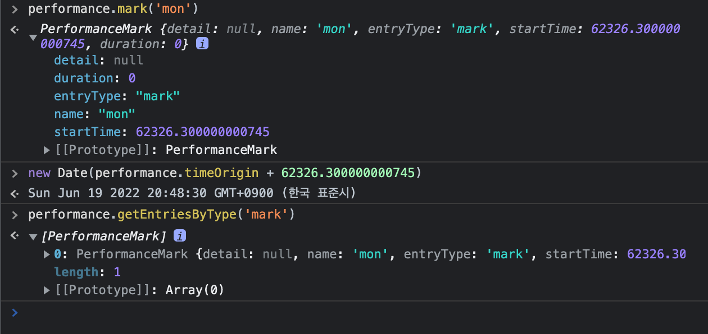

최근에 이벤트가 일어나는 timestamp를 알아내서 작업을 해야할 일이 있었다.

Web API의 Performance API와 이벤트의 timing 등을 이용하면, web에서 벌어지는 성능에 대한 꽤 정확하고 신뢰할만한 값들을 구할 수 있다.

# Performance API란?

페이지에서 수행 타이밍 관련 정보를 담고 있는 인터페이스.

`Window.performance`를 호출하면 해당 객체를 볼 수 있다. 객체의 프로퍼티들을 살펴보면 deprecated된 것들이 많아 사용에 주의가 필요하다. (navigation, timing 등)

## PerformanceEntry

web에서 일어나는 이벤트들이 **퍼포먼스 측정 시작점**으로부터 얼만큼의 시간(microsecond)이 지난 후 발생했거나 끝났는지 등의 정보를 제공하는 객체이다.

(`performance.timeOrigin`: 퍼포먼스 측정 시작점 timestamp)

어떤 타이밍 entry들이 있는지 확인하려면 콘솔에서 `performance.getEntries()`를 호출해보자. 이 함수는 모든 타입의 entry들을 배열로 준다.


`getEntriesByName`, `getEntriesByType` 등 entryType이나 name에 따라서 가져올 수 있는 함수도 제공된다.

이 객체는 여러 종류의 타입으로 구분되는데, 용도 별로 나눠서 살펴보도록 하자.

- 브라우저에서 측정된 값을 조회
- 직접 측정

## 1) 브라우저에서 측정된 값을 조회하는 용도

- PerformanceNavigationTiming
: document navigation 이벤트에 따른 로딩 타임 (ex. load, unload, redirect, …)
- PerformanceResourceTiming
: XMLHttpRequest나 이미지, 스크립트 등의 리소스 요청에 대한 로딩 타임
- PerformancePaintTiming
: 스크린에 paint가 일어나는 시점

### PerformanceNavigationTiming

브라우저 console에서 `performance.getEntriesByType('navigation')`을 호출해보면, 이 타입에 해당하는 PerformanceEntry들을 모아 배열로 보여준다. document 하나에 1개의 PerformanceNavigationTiming만 관리되는 것으로 보인다.

만약 document의 load 이벤트 시작 시점을 알고 싶다면, 아래의 두 값을 더하면 얻을 수 있다.

```tsx
performance.timeOrigin + performance.getEntriesByType(’navigation’)[0].loadEventStart
```


### PerformancePaintTiming

`performance.getEntriesByType('paint')`을 호출하면 해당 타입의 엔트리들을 보여준다. 스크린에 paint가 시작되는 시점을 알 수 있다.


## 2) **직접 측정을 위한 용도**

- PerformanceMark
: `performance.mark(name)`를 호출하면 그 시점을 해당 name의 엔트리로 저장한다
- PerformanceMeasure
    
    : `performance.measure(something)`를 호출하면, 브라우저의 퍼포먼스 타임라인에 두 mark 사이의 타임 간격을 저장한다.
    

### PerformanceMark

`performance.mark(name)` 을 찍어보면, 현재 시점의 timestamp가 PerformanceMark 타입의 entry로 남는 것을 볼 수 있다.



### PerformanceMeasure

mark를 두번 찍고 `performance.measure(measurename, markNameA, markNameB)`를 찍어보았다. startTime과 duration으로 두개의 mark 사이 시간 갭을 알 수 있다.

