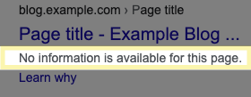

```html
User-agent: Googlebot
Disallow: /nogooglebot/

User-agent: *
Allow: /

Sitemap: http://www.example.com/sitemap.xml
```

위 예시처럼 작성하는 파일이다.

## 주 용도

1. 사이트의 크롤러 트래픽을 관리하기 위해
2. 구글에 특정 파일을 표시하지 않기 위해

## 생성

1. 사이트 호스트 root에 robots.txt를 위치
2. UTF-8로 인코딩된 텍스트 파일이어야 함(ASCII 포함)
3. 하나 이상의 규칙 포함 필요

## 규칙

### 가이드라인

- robots.txt는 하나 이상의 그룹으로 구성된다.
    - User-agent
    - Allow : 에이전트가 액세스할 수 있는 디렉터리나 파일
    - Disallow : 액세스할 수 없는 디렉터리나 파일
- 각 그룹은 여러개의 규칙 및 지시를 포함할 수 있고, 한 줄에 하나의 지시만 넣을 수 있다.
- 크롤러는 파일의 위에서 아래 방향으로 그룹을 처리한다. user agent는 가장 구체적인 그룹 중 첫 번째로 서술된 그룹 하나에만 매치될 수 있다.
- user agent는 기본적으로, disallow 규칙에 의해 차단되지 않는다면 어떤 디렉터리, 페이지도 크롤링 가능하다.
- 규칙은 대소문자를 구별한다. (case-sensitive)
- `#` 문자로 주석을 쓸 수 있다.

### 지시어 상세

- User-agent
    - 규칙이 적용되는 검색 엔진 이름. 별표(`*`) 사용 시 모든 크롤러에 규칙 적용

```html
# Example 1: Block only Googlebot
User-agent: Googlebot
Disallow: /

# Example 2: Block Googlebot and Adsbot
User-agent: Googlebot
User-agent: AdsBot-Google
Disallow: /

# Example 3: Block all but AdsBot crawlers
User-agent: *
Disallow: /
```

- Disallow
    - user agent가 크롤링하지 않도록 하는 디렉터리 or 페이지
    - 디렉터리라면 `/` 기호로 끝내야함
    - 주의사항: disallow를 쓴다고 검색 결과에 안 나오는 게 아니다. 다른 페이지에서 참조되는 경우는 disallow에 추가해도 검색 결과에 노출될 수 있으나 설명이 보이지 않는다.
        
    
        
- Allow
    - 주로 disallow 지시어로 허용하지 않은 디렉터리 하위에 있는 디렉터리나 페이지를 크롤링 허용할 때 쓰임
    - 디렉터리라면 `/` 기호로 끝내야함
- Sitemap
    - 선택사항
    - 정규화된 URL 사용 필요 (bad: 상대 URL이거나, 프로토콜을 포함하지 않는 URL)
    

### Tips

- [알아두면 좋은 규칙](https://developers.google.com/search/docs/advanced/robots/create-robots-txt#useful-robots.txt-rules)
- [robots.txt 테스터](https://support.google.com/webmasters/answer/6062598)