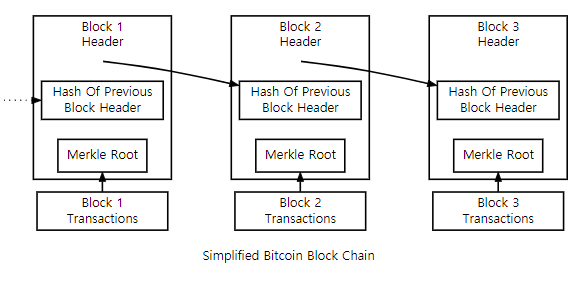

## 0. 서론
### I was busy, but lazy

Web 3.0이란 단어는 너무 많이 들리지만 잘 모르기 때문에 이제는 그러려니 하게 된, 메타버스와 동급 같은 단어로 느끼게 되어버렸다. 소프트웨어 개발자로 일하면서, 눈 앞의 지식을 취하는 것이 바빠 거시적인 흐름에는 크게 관심을 두지 않은 것이 조금은 부끄럽다. 먼저 그동안 막연히 여겼던 것부터 찾아봐야겠다고 생각했다.

어쨌든 관심이 생겼다 해서 이런 낯선 세계를 표면만 보고선 이해할 수가 없었다. 따라서 **Web 3.0의 출현 배경과 뒷받침하는 기술들의 실체**에 대해서 적당한 깊이로 알고 싶은 나를 위해 글을 써보고자 한다.

## 1. 새 시대의 도래

### 실체가 있는 것인가?

Web 3.0는 일종의 철학이며 시대를 표방한다. 새로운 철학이 나타나고, 이 철학을 뒷받침하기 위해 기술이 도구로 쓰이는 것이다.

우리가 Web 3.0이란 단어에 대해 모호한 이유는 아직 이 시대가 완전히 오지 않았기 때문이다. 관련 기술들이 아직 시장의 주류가 아니므로, 우리는 무엇을 기반으로 이 단어를 이해해야하는 지 알기 어렵다.

그렇다면 우리는 어떤 시대를 거쳐 2023년 지금 어떤 시대를 살고 있는지를 간단히 돌아보면서 다음 시대의 탄생 배경을 살펴보자.

### Web 1.0

1990년대 초기 Web 첫 출현 당시 시대를 의미한다. 웹 페이지 제작자가 제공한 정적인 정보를 ‘읽는 것’이 주요 패턴이다. 정적인 HTML 페이지와 이메일 송수신 정도의 수단이 존재했다.

### Web 2.0

2000년대 초부터는 수동적으로 한정적인 정보를 얻는 것에서 벗어나 플랫폼에 게시글을 직접 올리고 댓글을 다는 등 적극적인 소통이 중심이 된다. Google, Facebook 등 플랫폼 업체가 크게 성장하였다.

### Web 3.0

Web 2.0은 플랫폼 기업에 모든 정보가 ‘중앙집중’적으로 저장 및 관리된다. 이런 특성은 보안 상 한계와 수익 분배의 불균형으로 이어진다.

- 보안
    
    : 사용자들이 활발히 정보를 공유하는 기반은 플랫폼이고, 서비스를 제공하는 기업들이 정보를 독점적으로 소유한다. 이런 기업들의 서버가 공격 당했을 때 대량의 정보가 탈취 및 유실될 수 있는 위험이 있다.
    
- 수익 창출
    
    : 사용자가 플랫폼에 게시한 정보는 플랫폼의 수익을 창출하는 데에 이용될 수 있으며, 사용자의 개인 정보 또한 판매되거나 광고 노출 등에 이용될 수 있다. 컨텐츠를 생산한 사용자들에게는 수익이 배분되지 않는다.
    

Web 3.0은 ‘탈중앙화(decentralization)’를 추구한다. Web 1.0이 탄생한 배경에서는 이런 가치를 추구했지만, 기술적 한계로 실현될 수 없었다. 정보가 특정 기업들에 독점되지 않고, 가치를 직접 생산한 주체에게 수익이 돌아갈 수 있도록 하는 것이 목표이다.

## 2. 기술

새로운 기술은 Web 3.0가 추구하는 탈중앙화 철학을 실현하는 바탕이 된다.

### Blockchain

단어를 쉽게 풀어보면 block들을 연결(chain)하는 기술이다.

- Blockchain: 거래 기록을 모아둔 ‘디지털 장부(ledger)’이다. 이 장부는 블록체인 네트워크 전체에 고루 분산되어 복제된다.
    
    여러 참여 주체에 의해 관리되는 탈중앙화된 database를 분산 원장 기술(DLT; Distributed Ledger Technology)이라고 한다. Blockchain은 DLT의 일종이다. Hash라고 하는, 변경이 불가능한 암호 서명과 함께 거래들을 기록하는 DLT인 것이다.
    
- Node: blockchain의 복사본을 들고 있는 참여 주체이다. 블록체인 네트워크에 연결된 컴퓨터 또는 서버로서, 채굴을 하거나, 신규 거래를 검증하고 안전하게 장부에 추가하는 역할을 한다.

    - 블록체인 네트워크에 Node를 생성하려면, 구체적으로는 해당 네트워크에서 제공하는 소프트웨어를 받아 설치하는 형태가 일반적이다. 예를 들어 이더리움 네트워크의 경우, Geth나 Parity 등의 클라이언트를 다운 및 실행하면 된다.
        
    - 하나 알아둘 것은 node를 생성, 운영하는 데에 리소스(처리 능력, 대역폭 등)가 크게 요구된다. 따라서 장부 보관, 거래 검증까지 수행하는 full node 대신, 장부 보관 및 갱신만 하는 light node 역할만 할 수도 있다.

- Block: 블록체인 database를 구성하는 data 단위를 말한다. 복수의 거래 기록을 포함하며, 영구적인 기록 저장소로써 바꾸거나 지울 수 없다. 블록은 이전 블록의 hash와 신규 거래 정보들을 암호화해서 가지고 있다.
    
  
  <figcaption align="center"><i>Bitcoin 블록의 단순화된 버전</i></figcaption>
   
        
#### 블록의 생성 과정

1. 블록체인 네트워크에서 거래(transaction)가 발생하면 모든 node에 거래 내역을 알림(broadcast)
2. 채굴자는 거래들을 모아서 블록을 하나 생성함
    - 블록 사이즈는 블록체인 네트워크에 따라 기준이 다름
    - 비트코인의 경우 블록 사이즈는 1MB로, 2,500~3,000개 거래 포함 가능
3. 이 블록을 장부에 등록하려면, 네트워크에서 제시하는 복잡한 hash 조건을 충족시키는 값을 블록 헤더에 넣어야 함. 이 퍼즐을 푸는 과정을 `Proof of Work`라고 칭함
    - 아주 상당한 컴퓨팅 능력과 시간을 요함
    - 조건의 난이도는 해당 네트워크의 채굴 속도 현황에 따라서 달라짐
4. 채굴자가 퍼즐을 푸는 데 성공하면, 블록에 담긴 기록들이 네트워크의 모든 node에 의해 검증
5. 검증이 되면 블록체인에 블록이 추가되며, node들에 분산 복제
6. 채굴자는 보상을 받게 됨
    - 보상은 두 가지 케이스가 있음. 하나는 새 블록을 채굴한 노동에 대한 보상으로 받게 되는 블록 단위의 reward이고, 하나는 각 거래에 포함된 수수료.

#### 블록체인이 Web 3.0에서 중요한 이유

블록체인이 가져다줄 수 있는 혁신은, 은행 시스템 같은 third party 없이도 블록체인이 정보에 대해서 신뢰성을 보장할 수 있다는 것이다. 해커가 블록체인 시스템 하나를 망가뜨리려면 체인에 있는 모든 블록을 바꿔줘야 한다. Bitcoin, Ethereum 같은 블록체인은 블록들이 체인에 계속 추가되면서 지속적으로 규모가 커지고, 따라서 장부의 안전성이 크게 높아진다. 

### Smart contract

블록체인 네트워크에 기반하여, 특정 조건들이 부합했을 때 계약 조항을 자동으로 이행하는 프로그램의 형태를 말한다. 중개자 없이, 정해진 규약에 의해서 실행되기 때문에 탈중앙화에 부합하며 Web 3.0 생태계의 중심 요소가 되었다.

컴퓨터 과학자 Nick Szabo가 1994년에 컨셉을 최초 제안했고, 2015년 런칭한 Ethereum의 블록체인에 도입되었다. Ethereum을 시작으로 금융부터 공급망 관리, 게임 등 탈중앙 어플리케이션(dApps)에 광범위하게 쓰일 수 있게 되었다. 

Smart contract는 아래와 같은 특성을 가진다.

1. 신뢰가 필요 없는 거래 (Trustless transactions)
    
    : 프로그램에 따라 스스로 실행되기 때문에 제 3의 신뢰 가능한 중개자(은행, 변호사 등) 개입 필요성을 낮춤
    
2. 보안성
    
    : 암호화 기술로 지켜지기 때문에 사기 피해를 줄일 수 있음
    
3. 효율성
    
    : 매뉴얼한 개입 없이 자동화된 시스템이므로 기존 거래 방식에 소요되던 시간과 비용을 제거 가능함
    
4. 투명성
    
    : 누구나 smart contract의 조항들을 열람하고 실행을 검증할 수 있어 신뢰를 높이고 분쟁 가능성을 줄임
    
5. 프로그램화 가능
    
    : 여러 application이나 실제 사례들에 넓게 적용될 수 있도록 커스터마이징이 유연함
    

### Metaverse

Metaverse는 가상공간에서 3D 형태의 인터페이스를 제공하여, 현실 세계와 유사한 경험을 제공하는 가상 세계를 의미한다. Metaverse는 가상 화폐, 가상 자산, 가상 땅 등을 이용해 경제 시스템을 운영할 수 있으며, 가상 세계에서의 생활, 교육, 엔터테인먼트 등 다양한 산업의 발전 가능성을 지닌다.

Web 2.0의 중앙집중 환경에서도 존재 가능하지만(ex. 로블록스, 제페토) 이는 진정한 메타버스는 아니다.

현실과 똑같은 경제적 교류가 일어나야만 진정한 의미의 메타버스가 성립되기 때문이다. 제페토에서 구매한 아이템은 로블록스의 메타버스로 가져갈 수 없다. 메타버스 간의 호환을 위해서는 블록체인이 필요하다. 공공의 분산 저장소에 NFT로서 아이템이 저장된다면 제페토가 더이상 서비스되지 않아도 해당 아이템을 영구적으로 소유할 수 있을 것이다.

## 3. Web 3.0이 구현된 사례

암호화폐 이외에도 블록체인 기반으로 만들어진 서비스들을 볼 수 있다.

- [Steemit](https://steemit.com/): 소셜미디어 플랫폼. 직접 게시한 컨텐츠가 다른 사용자들의 추천을 받으면 그만큼의 수익을 게시자에게 가상화폐로 보상한다.
- [Status](https://status.im/): 메신저 플랫폼. P2P 방식을 통해 더욱 안전하게 메시지를 주고 받을 수 있으며 암호화폐 지갑을 보유할 수 있다.

## 4. 당면한 과제

기업 입장에서는 현재 모두에게 자료와 데이터를 공유하는 퍼블릭 블록체인에 서비스를 둘 만한 이유가 많지 않다. 퍼블릭 블록체인을 지향할수록, 블록체인을 만든 주체로서의 기업은 점점 플랫폼을 움직이는 힘을 잃기 때문이다. 서비스를 운영하는 일부 기업만이 제한적으로 참여하는 프라이빗 블록체인 기술 등이 대안이 될 수도 있겠으나 현재로서는 기술 발달이 더디다. 느린 속도나 보안 문제도 여전히 넘어야할 과제다. 

(해당 기사의 일부 문단을 그대로 인용하였다. : [[줌인IT] 제페토는 진짜 메타버스가 아니다](https://it.chosun.com/site/data/html_dir/2022/04/25/2022042501558.html))

## 5. 어떻게 대비할까?

웹 개발자로서 Web 3.0 시대를 대비하려면 무엇을 해야할 지 구체적인 방법들을 찾아봤다.

1. 블록체인 기반 web 개발 프레임워크들 배우기
    
    Ethereum, EOS 같은 blockchain 플랫폼들은 각자의 개발 프레임워크들이 있다. 예를 들어 Ethereum 블록체인과 소통하는 메서드를 제공하는 자바스크립트 라이브러리인 `web3.js`, 이오스의 경우 `EOSIO.js`가 있다. 이들을 이용해 탈중앙 앱들(dApps)을 만들어보고 blockchain과 연동해볼 수 있을 것이다.
    
2. Smart contract 개발에 도전해보기
    
    Smart contract는 Web 3.0 생태계의 핵심 요소이기 때문에, 어떻게 동작하는지 이해하거나 개발할 수 있으면 좋을 것이다. 블록체인 플랫폼에서 사용되는 `Solidity`, `Rust`, `Go` 등의 언어나 `Remix`라는 프레임워크를 배워볼 수 있다.
    
3. 블록체인 오픈소스 프로젝트에 기여하기
    
    웹 개발 스킬이 필요한 오픈 소스 프로젝트들은 UX나 웹 개발 등의 기여자들을 필요로 한다. 기여할 수 있는 것부터 직접 하다보면 관련 지식 영역을 넓혀나가는 데에 도움이 될 것이다.
    

---

## References

[[매거진 한경] 웹 3.0이 가져올 미래 변화는](https://magazine.hankyung.com/money/article/202202143142c)

[[Youtube] ‘웹3-블록체인-토큰-메타버스-VR·AR’ 완벽한 위계정리 (김지현 SK 부사장)](https://youtube.com/watch?v=ZUzIHjTs2dA&feature=share)

[[EuroMoney] What is Blockchain](https://www.euromoney.com/learning/blockchain-explained/what-is-blockchain)

[비트코인 개발자 가이드](https://wikidocs.net/14498)

[[줌인IT] 제페토는 진짜 메타버스가 아니다](https://it.chosun.com/site/data/html_dir/2022/04/25/2022042501558.html)